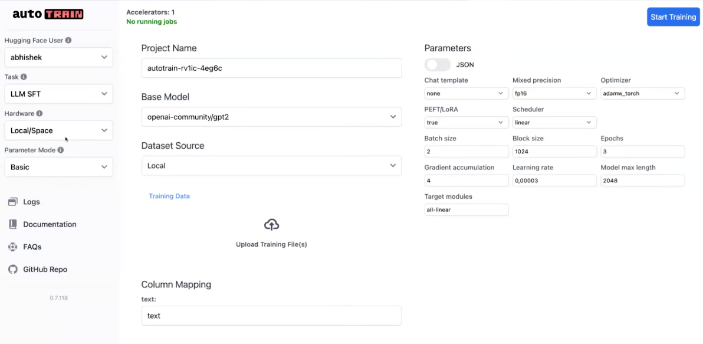

**No-code Platform**

1. Simplifies training of the state of the art models across multiple domains
   a. Natural Language Processing
   b. Computer vision
   c. Tabular data

2. Leverages powerful Hugging Face frameworks : transformers, datasets, diffusers, peft , accelerate etc

3. Accessible to a broader audience without requiring deep technical expertise

1. Chat template available as well.

**Reward model**

- Train custom reward model
- Sequence classification task
- Which example pair is more relevant

**DPO/ORPO**

- DPO : Direct preference optimization
- ORPO : Odds Ratio preference Optimization
- DPO needs reference model
- ORPO doesnt need reference model
- ORPO takes 50 percent less memory
- Prefer ORPO over DPO
- json lines format is prefered , it makes the process easier
- https://huggingface.co/docs/autotrain/en/index
- https://github.com/huggingface/autotrain-advanced
- You can also use jarvis labs to use autotrain
- If you need more compute , you can use NvidaDGX Cloud
- Also provides Docker support
- Multiple parameters that you can set.
- Logs available as well as a part of the platform
- Can also train on m1,m2 and m3 mac models
