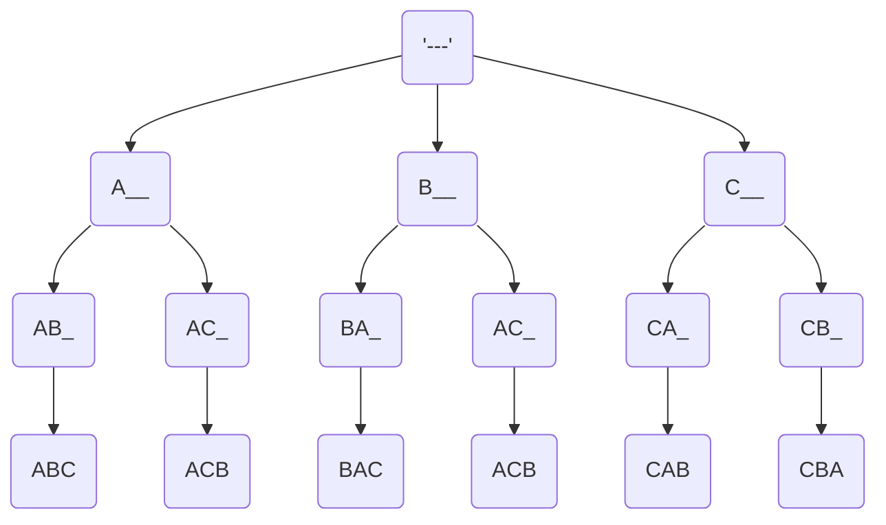
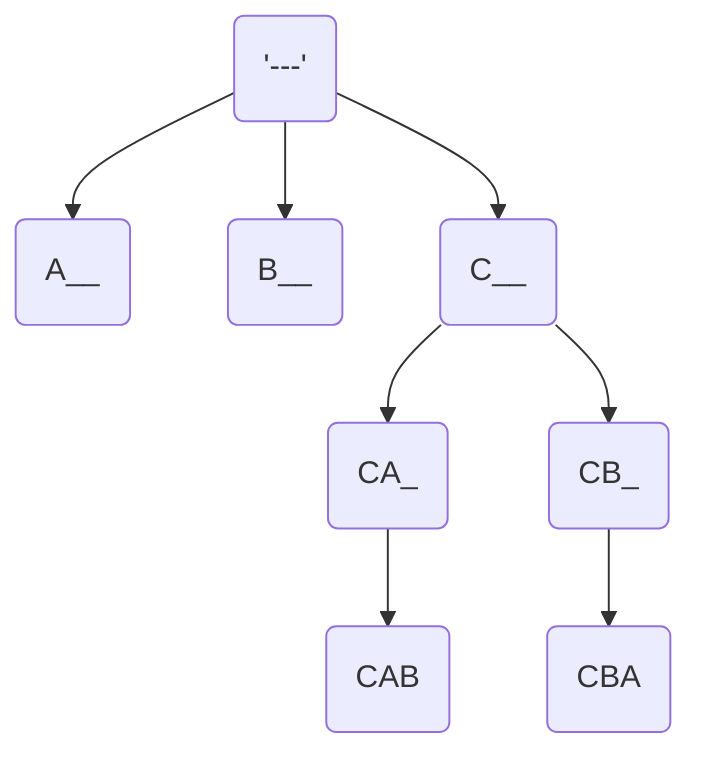
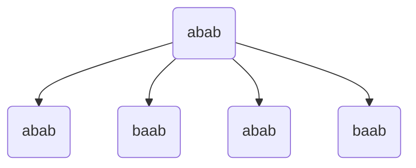

Given a string S with distinct characters, Print all the
permutations of the string.

s = abc
output: abc, acb, bac, bca, cab, cba

A string with N characters will have N! permuatations



Just use a single string and manipulate the string while traversing
back. Undo the action that you have done in the forward call.

Top to Bottom : Moves make actions
Bottom to Top : Undo Moves done in the first step.

**Backtracking in a nutshell**

1. Doing Something
2. Call function
3. Undo Something

```python
def permute(s:list,i:int):
    if i == len(s):
        print("".join(s))
    for k in range(i, len(s)):
        s[i],s[k] = s[k], s[i]
        permute(s, i+1)
        s[i], s[k] = s[k],s[i]

st = list("ABC")
permute(st, 0)

```

Time complexity : O(N! \* N) , N! for generating and then N time for loop.

How can we do this in lexicographic order ?



In the above graph you see that CBA is printed first than CAB

the reason is that its not sorted. One way to ensure for example

consider the string "abcdef" , Now when you swap a and e, you get
"ebcdaf" which is not sorted , we can get away this with this approach

which is whenever you swap also shift the elements to right or simply right rotate

"eabcdf" , Rotate i to j by unit if you are swapping i and jth element.

1. right rotate
2. function recursive call
3. left rotate

```python
def permute(s: list, i: int):
    if i == len(s):
        print("".join(s))
    else:
        for k in range(i, len(s)):
            # Rotate right
            s[i:k + 1] = rightrotate(s[i:k + 1])
            permute(s, i + 1)
            # Rotate back to original position (left rotation)
            s[i:k + 1] = leftrotate(s[i:k + 1])

def rightrotate(a: list):
    n = len(a)
    if n == 0:
        return
    # Save the last element
    last = a[-1]
    # Shift elements to the right
    for k in range(n - 1, 0, -1):
        a[k] = a[k - 1]
    a[0] = last  # Place last element at the front
    return a

def leftrotate(a: list):
    n = len(a)
    if n == 0:
        return
    # Save the first element
    first = a[0]
    # Shift elements to the left
    for k in range(1, n):
        a[k - 1] = a[k]
    a[n - 1] = first  # Place first element at the end
    return a

# Example usage
st = list("ABC")
permute(st, 0)
```

Print all the permuations (distinct) of a string which may contain duplicates

example : "aba"
output : aba, aab, baa

Total number of distinct permuations : $\frac{3!}{2!}$

example : "aab"



Here permutations are repeated for `abab` and `baab`

In order to avoid the tree from further growing we should track
the duplicate swaps and avoid those swaps if already done

```python

def permdup(st:list, i:int):
    if i == len(st):
        print(st)
        return

    freq = [0 for _ in range(26)]
    for j in range(i, len(st)):
        if freq[ord(st[j])-ord('a')] == 0:
            st[i] , st[j] = st[j], st[i]
            permdup(st,i+1)
            st[j] , st[i] = st[i] , st[j]
            freq[ord(st[j])-ord('a')]

st= list("abab")
permdup(st, 0)
```

**Paths**

Given an maze of 0's and 1's , a rat has travelled to n-1 and n-1
so that 0 is safe and 1 has poison.

Find all the paths from (0, 0) to (N-1, N-1), where only right
and down moves allowed.

<table>
    <tr>
        <td>0</td>
        <td>0</td>
        <td>1</td>
        <td>1</td>
    </tr>
<tr>
        <td>0</td>
        <td>0</td>
        <td>1</td>
        <td>0</td>
    </tr>
<tr>
        <td>1</td>
        <td>0</td>
        <td>1</td>
        <td>1</td>
    </tr>
<tr>
        <td>0</td>
        <td>0</td>
        <td>0</td>
        <td>0</td>
    </tr>

</table>

```python
def paths(a:list,i:int,j:int,N:int, pth:list):
    if a[i][j] == 1:
        return
    if i==j and j==N-1:
        print(pth)
        return
    pth.append((i,j))
    if i == N-1:
        paths(a, i, j+1, N, pth)
    elif j == N-1:
        paths(a, i+1, j,N, pth)
    else:
        paths(a, i+1, j,N, pth)
        paths(a, i, j+1, N, pth)
    pth.pop()

temp = []
a = [[0, 0, 1,1],[0,0,1,0],[1,0,1,1],[0,0,0,0]]
paths(a,0, 0, 4, temp)
```
