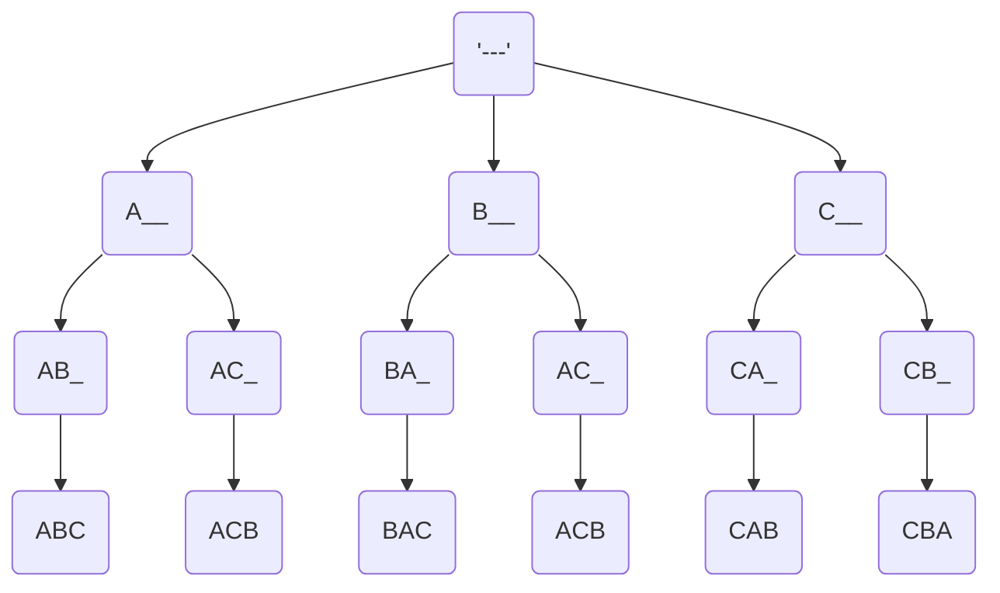
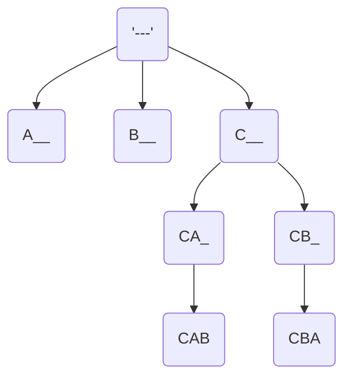
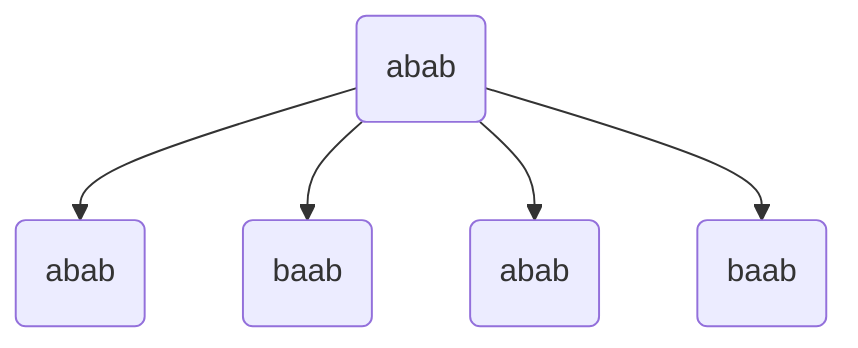

Given a string S with distinct characters, Print all the
permutations of the string.

s = abc
output: abc, acb, bac, bca, cab, cba

A string with N characters will have N! permuatations



Just use a single string and manipulate the string while traversing
back. Undo the action that you have done in the forward call.

Top to Bottom : Moves make actions
Bottom to Top : Undo Moves done in the first step.

**Backtracking in a nutshell**

1. Doing Something
2. Call function
3. Undo Something

```python
def permute(s:list,i:int):
    if i == len(s):
        print("".join(s))
    for k in range(i, len(s)):
        s[i],s[k] = s[k], s[i]
        permute(s, i+1)
        s[i], s[k] = s[k],s[i]

st = list("ABC")
permute(st, 0)

```

Time complexity : O(N! \* N) , N! for generating and then N time for loop.

How can we do this in lexicographic order ?



In the above graph you see that CBA is printed first than CAB

the reason is that its not sorted. One way to ensure for example

consider the string "abcdef" , Now when you swap a and e, you get
"ebcdaf" which is not sorted , we can get away this with this approach

which is whenever you swap also shift the elements to right or simply right rotate

"eabcdf" , Rotate i to j by unit if you are swapping i and jth element.

1. right rotate
2. function recursive call
3. left rotate

```python
def permute(s: list, i: int):
    if i == len(s):
        print("".join(s))
    else:
        for k in range(i, len(s)):
            # Rotate right
            s[i:k + 1] = rightrotate(s[i:k + 1])
            permute(s, i + 1)
            # Rotate back to original position (left rotation)
            s[i:k + 1] = leftrotate(s[i:k + 1])

def rightrotate(a: list):
    n = len(a)
    if n == 0:
        return
    # Save the last element
    last = a[-1]
    # Shift elements to the right
    for k in range(n - 1, 0, -1):
        a[k] = a[k - 1]
    a[0] = last  # Place last element at the front
    return a

def leftrotate(a: list):
    n = len(a)
    if n == 0:
        return
    # Save the first element
    first = a[0]
    # Shift elements to the left
    for k in range(1, n):
        a[k - 1] = a[k]
    a[n - 1] = first  # Place first element at the end
    return a

# Example usage
st = list("ABC")
permute(st, 0)
```

Print all the permuations (distinct) of a string which may contain duplicates

example : "aba"
output : aba, aab, baa

Total number of distinct permuations : $\frac{3!}{2!}$

example : "aab"



Here permutations are repeated for `abab` and `baab`

In order to avoid the tree from further growing we should track
the duplicate swaps and avoid those swaps if already done

```python

def permdup(st:list, i:int):
    if i == len(st):
        print(st)
        return

    freq = [0 for _ in range(26)]
    for j in range(i, len(st)):
        if freq[ord(st[j])-ord('a')] == 0:
            st[i] , st[j] = st[j], st[i]
            permdup(st,i+1)
            st[j] , st[i] = st[i] , st[j]
            freq[ord(st[j])-ord('a')]

st= list("abab")
permdup(st, 0)
```

**Paths**

Given an maze of 0's and 1's , a rat has travelled to n-1 and n-1
so that 0 is safe and 1 has poison.

Find all the paths from (0, 0) to (N-1, N-1), where only right
and down moves allowed.

<table>
    <tr>
        <td>0</td>
        <td>0</td>
        <td>1</td>
        <td>1</td>
    </tr>
<tr>
        <td>0</td>
        <td>0</td>
        <td>1</td>
        <td>0</td>
    </tr>
<tr>
        <td>1</td>
        <td>0</td>
        <td>1</td>
        <td>1</td>
    </tr>
<tr>
        <td>0</td>
        <td>0</td>
        <td>0</td>
        <td>0</td>
    </tr>

</table>

```python
def paths(a:list,i:int,j:int,N:int, pth:list):
    if a[i][j] == 1:
        return
    if i==j and j==N-1:
        print(pth)
        return
    pth.append((i,j))
    if i == N-1:
        paths(a, i, j+1, N, pth)
    elif j == N-1:
        paths(a, i+1, j,N, pth)
    else:
        paths(a, i+1, j,N, pth)
        paths(a, i, j+1, N, pth)
    pth.pop()

temp = []
a = [[0, 0, 1,1],[0,0,1,0],[1,0,1,1],[0,0,0,0]]
paths(a,0, 0, 4, temp)
```

**Paths II**

Given a maze 2d matrix m \* n

cell conditions

1. 0 --> Safe
2. 1 --> Source (exactly one cell)
3. 2 --> Dest ("")
4. -1 --> Unsafe

Moving Directions

1. Top
2. Bottom
3. Right
4. Left

Count the number of distinct paths from source to destination

<table>
    <tr>
        <td>0</td>
        <td>1</td>
        <td>0</td>
    </tr>
<tr>
        <td>0</td>
        <td>0</td>
        <td>0</td>
    </tr>
<tr>
        <td>0</td>
        <td>2</td>
        <td>-1</td>
    </tr>

</table>

In this case since all directions are allowed , we should make sure that we dont fall into a loop of moves.
In order to prevent that , we should maintain a 2d Matrix isVisited and mark it 1 as we visit each cell in our original maze matrix.
But this adds one more issue , that it blocks other paths to be consider if marked visited by a single path, this could be solved through backtracking as we will unmark the visited cell after we complete a path.

```python
def f(matrix : list, si:int, sj:int):
    m = len(matrix)
    n = len(matrix[0])
    isVisited = [[0 for _ in range(n)] for _ in range(m)]

    def isSafe(i:int, j:int):
        if i>=m or j>=n:
            return False
        elif i<0 or j<0:
            return False
        elif matrix[i][j] == -1:
            return False
        else:
            return True

    def countPaths(matrix:list, i:int, j:int, isVisited:list):
        if matrix[i][j] == 2:
            return 1

        isVisited[i][j] = 1
        _sum = 0

        if isSafe(i,j+1) and not isVisited[i][j+1]:
            _sum += countPaths(matrix, i, j+1, isVisited)

        if isSafe(i+1,j) and not isVisited[i+1][j]:
            _sum += countPaths(matrix, i+1, j, isVisited)

        if isSafe(i,j-1) and not isVisited[i][j-1]:
            _sum += countPaths(matrix, i, j-1, isVisited)

        if isSafe(i-1,j) and not isVisited[i-1][j]:
            _sum += countPaths(matrix, i-1, j, isVisited)

        isVisited[i][j] = 0
        return _sum

    cnt = countPaths(matrix, si, sj, isVisited)
    return cnt

matrix = [[0, 1, 0],
          [0, 0, 0],
          [0, 2, -1]]

f(matrix, 0,1)
```

**NQueens Problem**

Given an N \* N board , Place these N queens at some cells such that no 2 queens attack each other.

1. Queens attack in same column
2. Queens attack in same row
3. Queens attack in diagonal

For N = 1, 2, 3 there is no configuration , For N = 4 there are two configurations

<table>
    <tr>
        <td></td>
        <td>Q</td>
        <td></td>
        <td></td>
    </tr>
<tr>
        <td></td>
        <td></td>
        <td></td>
        <td>Q</td>
    </tr>
<tr>
        <td>Q</td>
        <td></td>
        <td></td>
        <td></td>
    </tr>
<tr>
        <td></td>
        <td></td>
        <td>Q</td>
        <td></td>
    </tr>

</table>
And the next configuration is a mirror image of the first configuration above

<table>
    <tr>
        <td></td>
        <td></td>
        <td>Q</td>
        <td></td>
    </tr>
<tr>
        <td>Q</td>
        <td></td>
        <td></td>
        <td></td>
    </tr>
<tr>
        <td></td>
        <td></td>
        <td></td>
        <td>Q</td>
    </tr>
<tr>
        <td></td>
        <td>Q</td>
        <td></td>
        <td></td>
    </tr>

</table>

```python

def isSafe(arr:list, r:int, c:int, N:int):
    # check the column
    # check the diagonals starting from r,c
    # and going upwards in both directions

    # check column
    for i in range(r):
        if arr[i][c] == 1:
            return False

    # check right upward diagonal
    i = r
    j = c
    while i>=0 and j<N:
        if arr[i][j] == 1:
            return False
        i-=1
        j+=1

    # check left upward diagonal
    i = r
    j = c
    while i>=0 and j>=0:
        if arr[i][j] == 1:
            return False
        i-=1
        j-=1
    return True

def printNQ(arr:list, r:int, N:int):
    if r == N:
        print(arr)
        return

    for c in range(N):
        #print(isSafe(arr,r,c,N), arr, r, c, N)
        if isSafe(arr, r, c, N):
            arr[r][c] = 1
            printNQ(arr, r+1, N)
            arr[r][c] = 0

N = 4
arr = [[0 for _ in range(N)] for _ in range(N)]
printNQ(arr, 0, 4)
```

**Sudoku Solver**

<table><tr><td>5</td><td>3</td><td>0</td><td>0</td><td>7</td><td>0</td><td>0</td><td>0</td><td>0</td></tr><tr><td>6</td><td>0</td><td>0</td><td>1</td><td>9</td><td>5</td><td>0</td><td>0</td><td>0</td></tr><tr><td>0</td><td>9</td><td>8</td><td>0</td><td>0</td><td>0</td><td>0</td><td>6</td><td>0</td></tr><tr><td>8</td><td>0</td><td>0</td><td>0</td><td>6</td><td>0</td><td>0</td><td>0</td><td>3</td></tr><tr><td>4</td><td>0</td><td>0</td><td>8</td><td>0</td><td>3</td><td>0</td><td>0</td><td>1</td></tr><tr><td>7</td><td>0</td><td>0</td><td>0</td><td>2</td><td>0</td><td>0</td><td>0</td><td>6</td></tr><tr><td>0</td><td>6</td><td>0</td><td>0</td><td>0</td><td>0</td><td>2</td><td>8</td><td>0</td></tr><tr><td>0</td><td>0</td><td>0</td><td>4</td><td>1</td><td>9</td><td>0</td><td>0</td><td>5</td></tr><tr><td>0</td><td>0</td><td>0</td><td>0</td><td>8</td><td>0</td><td>0</td><td>7</td><td>9</td></tr></table>

Use Backtracking and recursive approach to fill in the zeros in the table above to solve sudoku.

```python
def solveSudoku(board: list):
    ansfound = [False]  # Use a list to allow mutation within ss
    row_freq = []
    col_freq = []
    mat_freq = []
    ans = []

    # Calculate frequency for rows
    for i in range(9):
        r_f = [0 for _ in range(9)]
        for j in range(9):
            if board[i][j] != 0:
                r_f[board[i][j] - 1] += 1
        row_freq.append(r_f)

    # Calculate frequency for columns
    for j in range(9):
        c_f = [0 for _ in range(9)]
        for i in range(9):
            if board[i][j] != 0:
                c_f[board[i][j] - 1] += 1
        col_freq.append(c_f)

    # Calculate frequency for 3x3 matrices
    for i in range(0, 9, 3):
        for j in range(0, 9, 3):
            m_f = [0 for _ in range(9)]
            for i1 in range(3):
                for j1 in range(3):
                    if board[i + i1][j + j1] != 0:
                        m_f[board[i + i1][j + j1] - 1] += 1
            mat_freq.append(m_f)

    def getMatNum(i, j):
        '''
        Row Calculation (i // 3):
        This integer division divides the row index i by 3. It effectively groups the rows into sets of three:
        For i = 0, 1, 2 → 0 (first subgrid)
        For i = 3, 4, 5 → 1 (second subgrid)
        For i = 6, 7, 8 → 2 (third subgrid)
        Column Calculation (j // 3):

        This similarly divides the column index j by 3 to group the columns:
        For j = 0, 1, 2 → 0 (leftmost subgrid)
        For j = 3, 4, 5 → 1 (middle subgrid)
        For j = 6, 7, 8 → 2 (rightmost subgrid)
        Combining Row and Column:

        The total index of the 3x3 subgrid is calculated by combining the row and column results:
        The formula (i // 3) * 3 + (j // 3) effectively maps each cell to its corresponding subgrid index:
        The first row of subgrids corresponds to indices 0, 1, 2 (for rows 0, 1, 2).
        The second row of subgrids corresponds to indices 3, 4, 5 (for rows 3, 4, 5).
        The third row of subgrids corresponds to indices 6, 7, 8 (for rows 6, 7, 8).

        '''
        return (i // 3) * 3 + (j // 3)

    def ss(board, i, j):
        if ansfound[0]:
            return

        if i == 9:  # If we've filled the board
            ansfound[0] = True
            ans.clear()
            for row in board:
                ans.append(row.copy())
            return

        # Move to the next cell
        next_i, next_j = (i, j + 1) if j < 8 else (i + 1, 0)

        if board[i][j] != 0:
            ss(board, next_i, next_j)
            return

        matnum = getMatNum(i, j)
        for val in range(9):
            if row_freq[i][val] == 0 and col_freq[j][val] == 0 and mat_freq[matnum][val] == 0:
                # Do
                board[i][j] = val + 1
                row_freq[i][val] = 1
                col_freq[j][val] = 1
                mat_freq[matnum][val] = 1

                # Recurse
                ss(board, next_i, next_j)

                # Undo
                if not ansfound[0]:  # Only undo if we haven't found a solution
                    board[i][j] = 0
                    row_freq[i][val] = 0
                    col_freq[j][val] = 0
                    mat_freq[matnum][val] = 0

    ss(board, 0, 0)
    return ans

board = [[5,3,0,0,7,0,0,0,0],
         [6,0,0,1,9,5,0,0,0],
         [0,9,8,0,0,0,0,6,0],
         [8,0,0,0,6,0,0,0,3],
         [4,0,0,8,0,3,0,0,1],
         [7,0,0,0,2,0,0,0,6],
         [0,6,0,0,0,0,2,8,0],
         [0,0,0,4,1,9,0,0,5],
         [0,0,0,0,8,0,0,7,9]]

solveSudoku(board)

# output
#[[5, 3, 4, 6, 7, 8, 9, 1, 2],
# [6, 7, 2, 1, 9, 5, 3, 4, 8],
# [1, 9, 8, 3, 4, 2, 5, 6, 7],
# [8, 5, 9, 7, 6, 1, 4, 2, 3],
# [4, 2, 6, 8, 5, 3, 7, 9, 1],
# [7, 1, 3, 9, 2, 4, 8, 5, 6],
# [9, 6, 1, 5, 3, 7, 2, 8, 4],
# [2, 8, 7, 4, 1, 9, 6, 3, 5],
# [3, 4, 5, 2, 8, 6, 1, 7, 9]]
```
