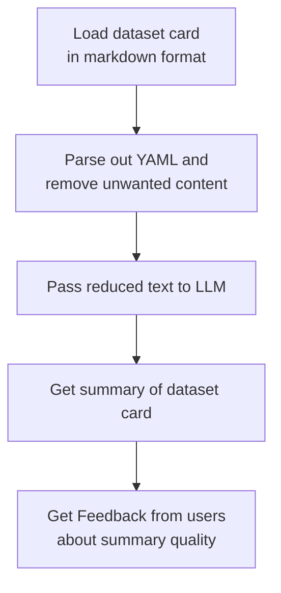
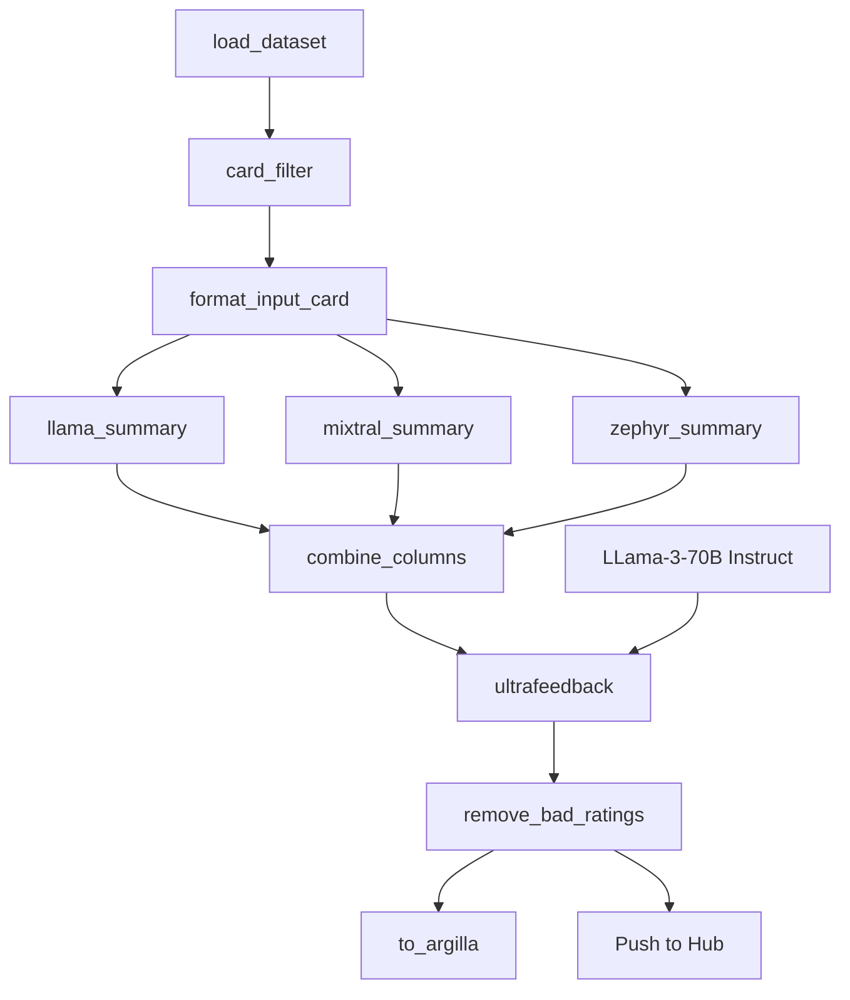

**Find existing datasets**

1. Reusing existing datasets from huggingface
2. Find domain and task specific datasets you will often need to search for deep cuts
3. Research dataset != always useful and high quality for your purpose
4. Do you have feedback from users that cna be used as `preference data`
5. Internal data/ readily available data
6. Synthetic data

Common dataset genres : SFT (supervised finetuning)

    `question and response`

Common dataset genres : RLHF (Reinforcement learning by human feedback)

1.  Common dataset genres : DPO (Direct preference optimization)

        `input , chosen response, rejected response`

Common dataset genres : KTO : Binary preference

    `input , yes , no`

**Synthetic Data**

1. `Generate`
   a. prompt
   b . completions

2. `Rephrase`
   a. EvolComplexity
   b. EvolQuality

3. `Judge`
   a. Scores
   b. Preferences
   c. Rationale/Critique

**GPT-4 Preference Annotation**

1.  Instruction-following
2.  Truthfulness
3.  Honesty
4.  Helpfulness

So better synthetic data

**Tools**

1. `Outlines package`
   a. RegEx
   b. JSON
   c. Pydantic
   d. Function calling

2. `DSPy-Programming not prompting`

   a. prompts
   b. LLM weights

3. `Distilabel-synthetic data and AI feedback`
   a. DAG Pipelining framework
   b. Serializable pipelines
   c. Cached results
   d. Structured generation
   e. Parallelizable

Improving data

1. Diversity
2. Quantity
3. Quality

Data Requirements (Based on open source papers and research)

1. SFT - 10k
2. ORPO - 7K
3. DPO - 3K
4. SPIN - 2K

Tools for annotation

1. probl
2. Human annotation : Lilac
3. Human annotation : argillia

---

**A case study :LLM Summarizer**

---

**Distillabel Pipeline**

---

https://github.com/davanstrien/data-for-fine-tuning-llms
