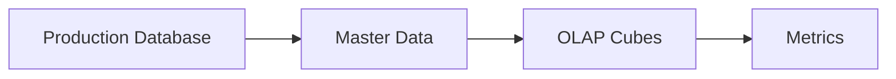
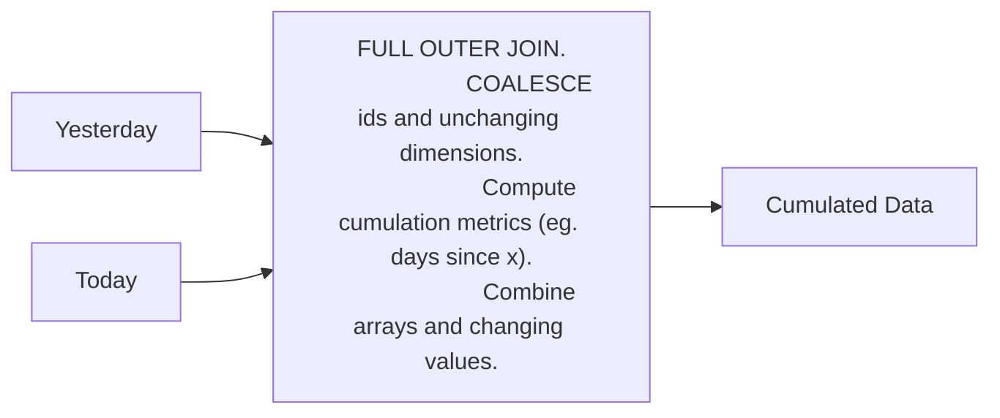

**Dimensions Outline**

1. Knowing your data consumer
2. OLTP vs OLAP
3. Cumulative Table Design
4. The compactness vs usability trade off.
5. Temporarily cardinality explosion
6. Run-length encoding compression gotchas

Dimensions are attributes of an entity

- Users Birth Date
- Users Favorite

some dimensions may also identify an identity

Dimensions come in two flavors

1. Slowly changing (example : Favorite Food)
2. Fixed ( Example : Height , Gender)

**Knowing your consumer**

1. Data Analysts/Data scientists : Should be very easy to query , not many complex data types (OLAP Cubes)
2. Other Data engineers : Should be compact and probably harder to query , Nested types are okay.
3. ML Models : Depends on the model and how it is trained.
4. Cusotmers : Should be very easy to interpret (charts mostly)

**OLTP vs Master Data vs OLAP**

1. OLTP(Online transaction processing) : Optimizes for low latency , low-volume queries
2. OLAP (Online analytical processing) : Optimizes for large volume , group by queries , minimizes joins
3. Master Data : Optmizes for completeness of entity definitions , deduped

Mismatching needs = less business value

Some of the biggest problems in data engineering occur when data is modelled for the wrong consumer

`Master Data` : Talking all production databases and crating master data

**Cumulative Table Design**

5. Core Components

   - 2 dataframes (yesterday and today)
   - Full outer join the two data frames together
   - Coalesce values to keep everthing around
   - Hang onto all of history

6. Usages

   - Growth analytics at Facebook (dim_all_users)
   - State transition tracking

**Strengths**

- Historical analysis without shuffle
- Easy `transition` analysis

**Drawbacks**

- Can only be backfilled sequentially
- Handling PII data can be a mess since deleted/inactive users get carried forward

**Compactness vs usability tradeoff**

1. The most usable table usually
   - Have no complex data types
   - Easily can be manipulated with `WHERE` and `GROUP BY`
2. The most compact tables (not human readable)
   - Are compressed to be as small as possible and can't be queried directly unitl they're decoded
3. The middle-ground tables
   - Use complex data types (e.g ARRAY, MAP and STRUCT), making querying trickier but also compacting more

When would you use each type of table ?

- Most compact

  - Online systems where latency and data volumes matter a lot. Consumers are usually highly technical

- Middle-ground

  - Upstream staging/master data where the majority of consumers are other data engineers

- Most usable
  - When analytics is the main consumer and the majority of consumers are less technical

**Struct vs Array vs Map**

- Struct
  - Keys are rigidly defined, compression is good
  - Values can be any type
- Map

  - Keys are loosely defined, compression is okay
  - Values all have to be the same type

- Array
  - Ordinal
  - List of values that all have to be the same type

**Idempotent pipelines**

Your pipeline produces the same results regardless of when its ran.

What does idempotent mean ?

denoting an element of a set which is unchanged in value when multiplied or otherwise operated on by itself.

Pipelines should produce the same results

1. Regardless of the day you run it.
2. Regardless of how many times you run it.
3. Regardless of the hour that your run it.

Why is troubleshooting non-idempotent pipelines hard ?

- silent failure
- You only see it when you get data inconsistencies and a data analyst yells at you.

What can make a pipeline not idempotent ?

- INSERT INTO without TRUNCATE
  - Use MERGE or INSERT OVERWRITE every time please
- Using Start_date > without a corresponding end_date <
- Not using a full set of partition sensors
  - (pipeline might run when ther is no / partial data)
- Not using depends_on_past for cumulative pipelines.

What can make a pipeline not idempotent

- Relying on the "latest" partition of a not properly modeled SCD(slowing changing dimension) table
  - So much pain at Facebook, Daily dimensions and "latest" partition is a very bad idea
  - cumulative table design amplifies this bug
- Relying on the "latest" partition of anything else

The pains of not having idempotent pipelines

- backfilling causes inconsistencies between the old and restated data
- very hard to troubleshoot bugs
- unit testing cannot replicate the production behavior
- silent failures

Should you model as slowly changing dimensions ?

- Max, the creator of Airflow hates SCD data modelling
- What are the options here ?
  - Latest snapshot
  - Daily/Monthly/Yearly snapshot
  - SCD
- How slowly changing are the dimensions you're modelling ?

Why do dimensions change ?

- Someone decides they hate iphone and want android now
- someone migrates from team dog to team cat
- someone migrates from USA to another country

How can you model dimensions that change ?

- Singular snapshots
  - Be careful since these are not idempotent
- Daily partitioned snapshots
- SCD types 1, 2, 3

SCD Types

1.  Type 0 : Arent actually slowly changing (e.g birth date)
2.  Type 1 : You only care about the latest value ( Never use this type because it makes your pipelines not idempotent anymore)
3.  Type 2 :

    Gold standard of SCD - You care about what the values was from "start_date" to "end_date"

        - Current values usually have either an end_date that is
            - NULL
            - Far into the future like 9999-12-31
        - Hard to use:
            - Since theres more than 1 row per dimension, you need to be careful about filtering on time
        - The only type of SCD that is purely `IDEMPOTENT`

4.  Type 3 :

    1. You only care about "original" and "current"
    2. Benefits
       1. You only have 1 row per dimension
    3. Drawbacks
       1. You lose the history in between original and current
    4. is this idempotent ?
       1. Partially , which means it's not.

SCD2 Loading

- Load the entire history in one query

  - Inefficient but nimble
  - 1 query and your'e done

- Incrementally load the data after the previous SCD is generated

  - Has the same "depends_on_past" constraint
  - Efficient but cumbersome
