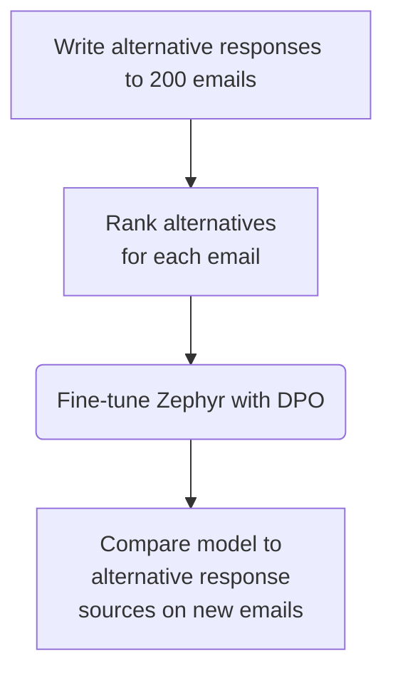
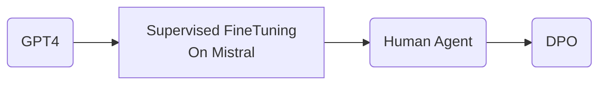

What is Fine Tuning ?

<table>
<tr>
        <th style = "color: brown">
            Query
        </th>
        <th style = "color:green">
            Response
        </th>
</tr>
</tr>
        <td style = "color: brown">
            What servos do you recommend for someone building a 4dof robotic arm on a $200 budget ?
        </td>
        <td style = "color:green">
            The SG90 is probably the best option because its cheap and small. Its not very precise, but you get what you pay for.
        </td>

</tr>
</table>

Templating

  
What servos do you recommend for someone building a 4DOF robotic arm on a $200 budget? ### The SG90 is probably the best option because it's cheap and small. It's not very precise, but you get what you pay for.

**Concrete Advice**
You should definitely try not to finetune, you should prove to yourself before finetuning. A lot of times you might need few shot prompting

Why ?

Models are getting better , but at the sametime if your data is not represented and if its very niche data , then finetuning makes sense.

_Example_ : A logistics company wanted an LLM to predict the value of shipped items based on the 80 character item description

Interesting way to solve it

<table>
<tr>
        <th style = "color: blue">
            Description
        </th>
        <th style = "color:blue">
            Value
        </th>
</tr>
    <tr>
        <td>Sweater that Ron left in my car</td>
        <td>40</td>
    </tr>
<tr>
        <td>...</td>
        <td>...</td>
    </tr>

</table>

What went wrong ?

1. Learned that responses were round numbers, but not great at getting approximately right values - Inappropriate loss function
2. Training data had "wrong" small values
3. Many incomprehensible descriptions due to length limit
4. Conventional NLP/ML also not good enough

**Case Study : Honeycomb - NL to Query**

1. Natural Language Query
2. Schema of the Table as context
3. combine 1 and 2 with a prompt
4. also add few shot examples

Reasons to finetune

1. Data privacy
2. Quality vs latency tradeoff
3. Extremely narrow problem
4. prompt engineering is impractical

Result : Finetuned model was faster, more compliant and higher quality vs GPT3.5

How much samples are necessary for finetuning ?
The least is 100 samples

**Rechat Case study**

CRM for real estate

A chat bot is very large domain

1. Manage user expectations
2. Large surface area
3. combination of tools
4. Compromise more specificity

Make each of the tools one by one and finetune each of one of them.

Really be sckeptical about chatbots, dont do unless necessary

When to Fine Tune ?

1. Wnat bespoke behavior

When to Fine Tune ?

1. Wnat bespoke behavior

When to Fine Tune ?

1. Wnat bespoke behavior
2. Valuable enough to justify operational complexity
3. Have examples of desired input/outputs

**Direct Preference Optimization**

Supervised fine tuning

1. You have a prompt and response
<table>
<tr>
        <th style = "color: blue">
            Prompt
        </th>
        <th style = "color:blue">
            Response
        </th>
</tr>
    <tr>
        <td>Lorem epsum ...blah blah</td>
        <td>blah blah , everyday</td>
    </tr>
<tr>
        <td>...</td>
        <td>...</td>
    </tr>

</table>

2. **DPO** : Direct preference optimization , humans are good at telling which response they prefer rather than telling the actual response

<table>
<tr>
        <th style = "color: blue">
            Prompt
        </th>
        <th style = "color:blue">
            Better Response
        </th>
<th style = "color:blue">
            Worst Response
        </th>

</tr>
    <tr>
        <td>Lorem epsum ...blah blah</td>
        <td>blah blah , everyday</td>
        <td>everything,is done everyday</td>
    </tr>
<tr>
        <td>...</td>
        <td>...</td>
        <td>...</td>
    </tr>

</table>

Almost all the leaderboard top models use Direct preference optimization

Usecase : DPO for customer service at large publisher

Order in which is the best approach to follow
_From Worst to Best in terms of Results_

