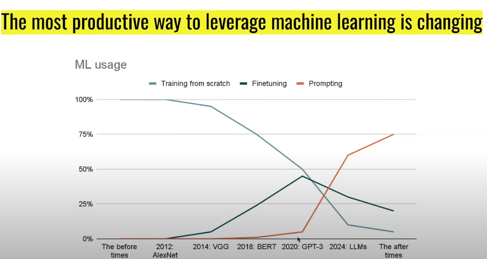
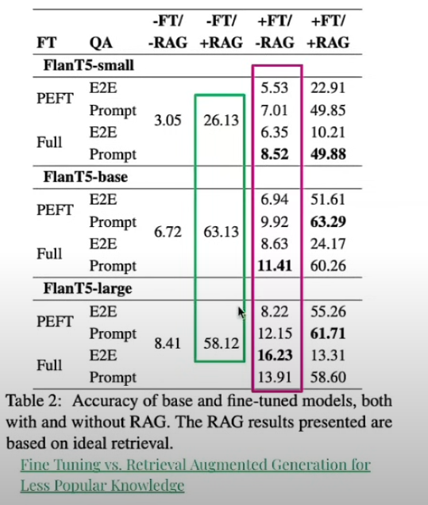
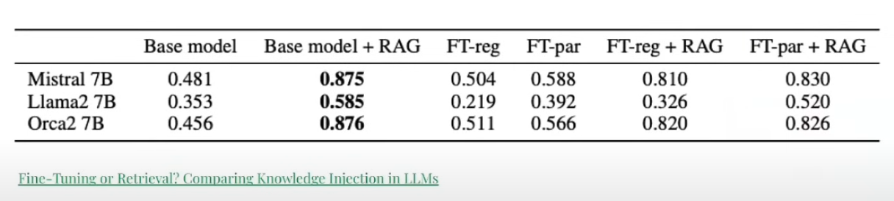
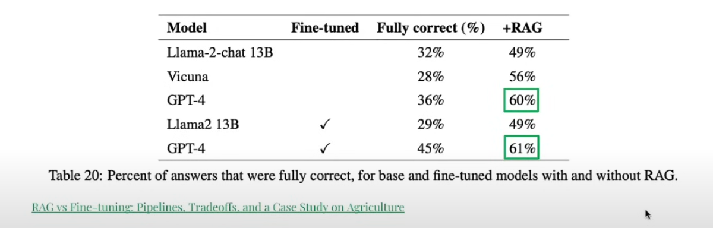
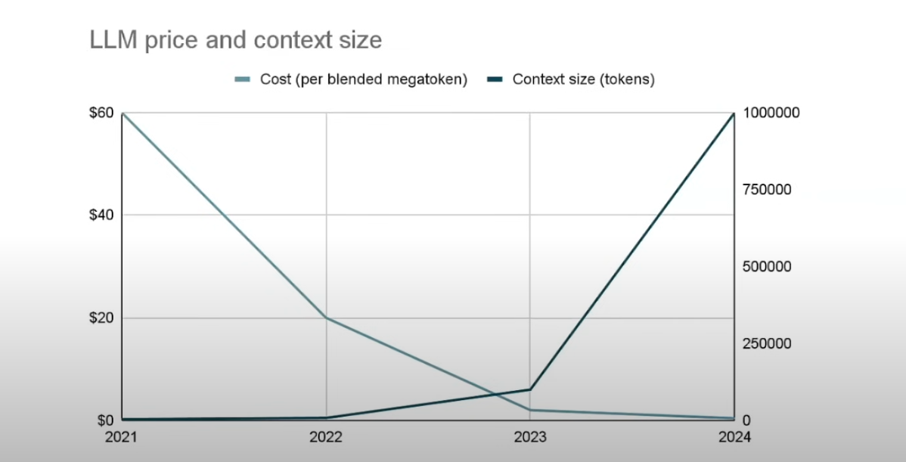

**Be sckeptical about everything that looks cool**

2009 : Train models no just write sql queries

2012 : Use deep learning , no just use xgboost

2015 : Invent a new loss function , no clean your data

2023 : Train your own LLM , no Make better prompts

2024 : Fine tune your own LLM , no Make better prompts

As these models get better , these models will understand incontext , so finetuning for the future is waste of time

- Most the gains come from RAG
- The impact of finetuning disappears for large models

Reference paper : https://arxiv.org/abs/2403.01432

Finetuning is not the solution if you want to add knowledge
Reference paper : https://arxiv.org/abs/2312.05934

Finetuning generally add style spectrum instead of knowledge
Base model has something called "World model" , but if you want to get something which are changing facts you go for RAG

Example : https://arxiv.org/abs/2401.08406

**Optimal machine learning : average time spent per task**

1. 80% collect a dataset , clean it , enrich it and label it
2. 18% serving and monitoring (building scalable serving infra, drift detection , etc)
3. 2% Debug ML issues

**Better things to do**

1. Building an evaluation set that is :
   - representative , large and easy to run
2. Spending days working on prompts and RAG
3. Investing in monitoring and error detection

**Bottomline** : Finetuning is dead, just work on your prompts since as the models become intelligent and the cost per token becomes cheaper especially with large context plus low inference , finetuning will be of no use
