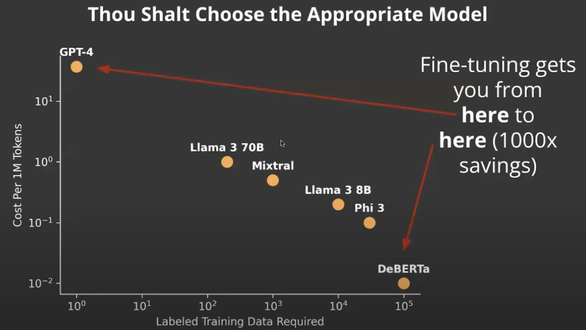

**Dont finetune is the default**

1. Just use prompting
2. And optionally few shot examples/RAG

**Finetune only if**

1. Unless you cant hit your quality target
2. or latency target
3. or cost target

Even if this the case above , still you should do prompting
which might help with

1. Create a baseline
2. prove the task is possible

**Stats on success**
If it works with prompting , there is a `90%` chance fine-tuning makes it better
If it doesnt work with prompting, there is only `25%` chance fine-tuning works at all

OpenPipe is one of the tools to monitor data : https://openpipe.ai/

Manually review the data and label it where its bad

1. Some bad data is ok
2. Make sure dataset is correct on average

**Have a test set**

1. make sure the test set is a random sub sample of input data

**Which model to finetune ?**

1. Consider the cost vs label training data required

Sweet spot for model tuning models

1. Mixtral 7B
2. Llama3 8B

**Write Fast Evaluations**

1. Use LLM as judge

**Also write slow Evaluations**

1. Customer , product specific evaluation
