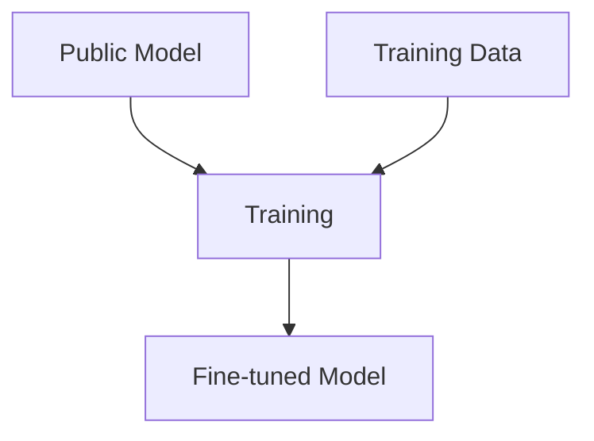
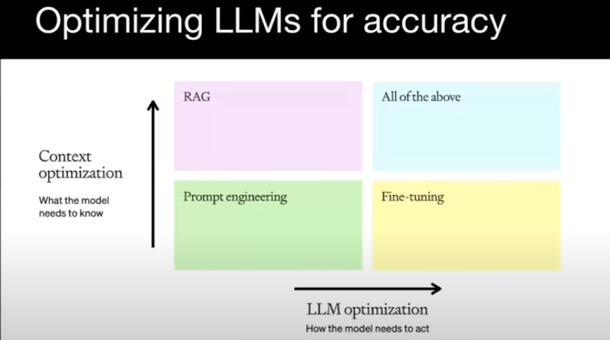
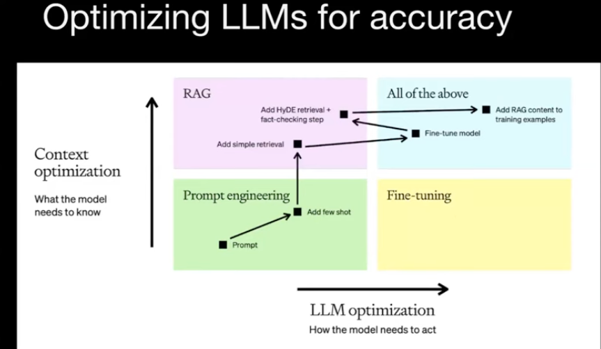
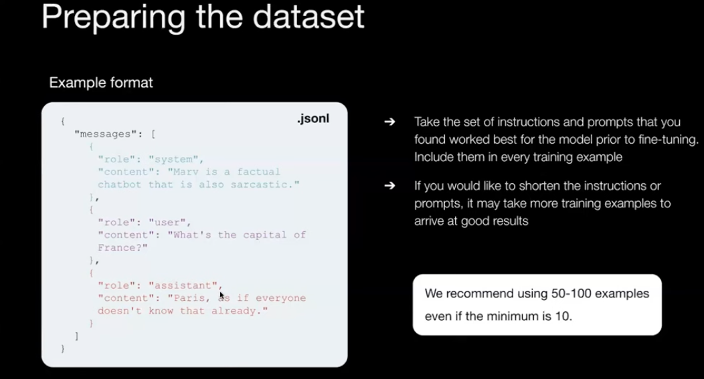
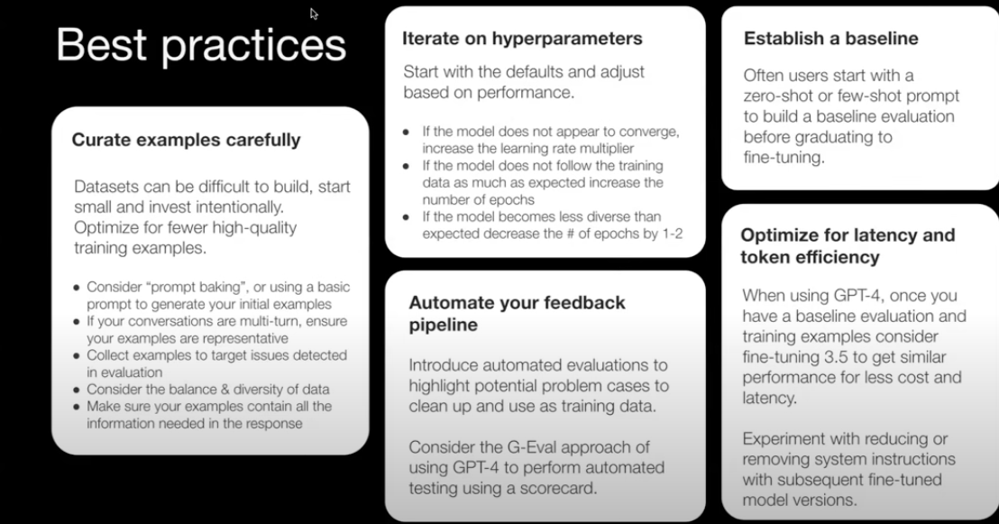

**Terminoloy**

- Fine-tuning a model consists of training the model to follow a set of given input/output examples
- This will teach the model to behave in a certain way when confronted with a similar input in future

<table>
<tr>
<th>Good for ✅</th>
<th>Bad for ❌</th>
</tr>
<tr>
        <td>Following a given format or tone for the output</td>
        <td>Teaching the model new knowledge : Use RAG or custom models instead</td>
</tr>

<tr>
        <td>Processing the input following specific, complex instructions</td>
        <td>Performing well at multiple , unrelated tasks, Do prompt-engineering or create multiple FT models instead</td>

</tr>
<tr>
        <td> Improving latency, Reducing token usage</td>
        <td>Including up to date content in responses : Use RAG instead</td>
</tr>

</table>

**Context optimization**

What the model needs to know : Use prompt-engineering followed by RAG

**LLM optimization**

How the model needs to act : User prompt-engineering followed by Fine-tuning

1. https://cookbook.openai.com/
2. https://platform.openai.com/docs/guides/optimizing-llm-accuracy

3. Build your project a set of evals, and use those for improving the LLM systems

**Prepare Dataset**

If the weight parameter is to `zero` its not going to learn anything from those messages in the chat
It wont be learning anthing from the response , but it will be learning to see the context in this case.

**Hyper parameters**

- Epochs : 4 , but use 2
- Batch size : 0.2% \* N
- Learning rate multiplier : 0.05, 0.1 or 0.2

**Icelandic Grammar correction** usecase , used finetuning and evaluated on `edit distance` and `BLEU` score performed well

Advantages of Open AI models

1. State of the Art
2. Tool calling
3. Function calling
4. Deployment is easier

Function calling eval : https://gorilla.cs.berkeley.edu/leaderboard.html

less than 1 percent of api users are using finetuning from openai

**Agents**

1. Github workspaces
2. Devin
