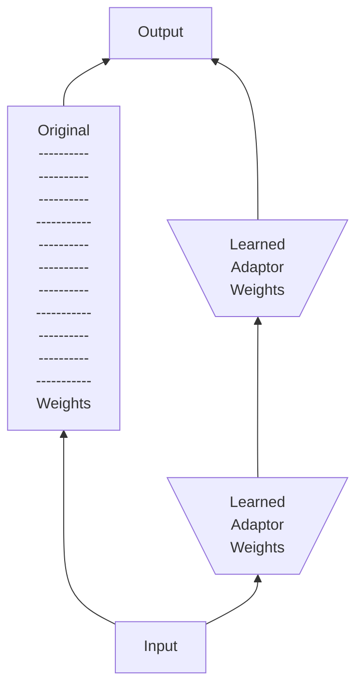

**Base Model**

1. Model size : `7B`, `13B` works most of the time
2. Check Huggingface or r/LocalLama subredit thread

**LoRA or Full Fine Tune ?**

Almost always use LoRA , LoRA in a nutshell

**Configuration**

1. Input : 4000 dimensions
2. Output : 4000 dimensions
3. Original Weights : $4000 * 4000 = 16M$
4. Adaptor rank : 16
5. LoRA weights : $2*16*4000 = 128000$

**QLoRA**

1. LoRA at lower precision
2. Memory savings with possible loss in quality

The payoff in improving the data is so large than to fiddle with hyperparameters

What is **Axolotl**

1. Wrapper for Hugging Face tools
2. Easy to use so you can focus on your data
3. Best practices built-in

https://github.com/axolotl-ai-cloud/axolotl

https://github.com/axolotl-ai-cloud/axolotl?tab=readme-ov-file#usage

Complete Hands on using Axolotl : https://github.com/parlance-labs/ftcourse

For filtering , deduplication of data : https://www.lilacml.com/

**Hamels Case Study : HoneyComb experience**

1. Create Prompt
2. Create level 1 evals , unittests etc
3. Generate synthetic data
4. prepare data for example templating
5. training
6. sanity check
7. create level 2 evals, human evalution , other evals which are important
8. get critique feedback , create llm as judge and then curate data again

**Understanding GPU Usage\***

General estimate (bert-base-cased, 108M params)

- Each parameter is 4 bytes
- Backward pace needs ~= 2x the model size
- The optimizer step ~= 4x the model size (1x model , 1x gradients, 2x optimizer)

<table>
    <tr>
        <th>
            dtype
        </th>
         <th>
            Model
        </th>
         <th>
            Gradients
        </th>
         <th>
            Backward pass
        </th>
        <th>
            optimizer step
        </th>
        <th>
            Highest
        </th>
    </tr>
    <tr>
        <td>float32</td>
        <td>413.18MB</td>
        <td>413.18MB</td>
        <td>826.36MB</td>
        <td>1.61GB</td>
        <td>1.61GB</td>
    </tr>
    <tr>
        <td>float16</td>
        <td>413.18MB</td>
        <td>619.77</td>
        <td>826.36MB</td>
        <td>826.36MB</td>
        <td>826.36MB</td>
    </tr>

</table>

This works find for small models, we have cards with anywhere from 12-24GB of GPU memory on the GPU-poor side

But what happens as we scale

Here's llama-3-8B (8.03B parameters)

<table>
    <tr>
        <th>
            dtype
        </th>
         <th>
            Model
        </th>
         <th>
            Gradients
        </th>
         <th>
            Backward pass
        </th>
        <th>
            optimizer step
        </th>
        <th>
            Highest
        </th>
    </tr>
    <tr>
        <td>float32</td>
        <td>28.21GB</td>
        <td>28.21GB</td>
        <td>56.43GB</td>
        <td>112.84GB</td>
        <td>112.84GB</td>
    </tr>
    <tr>
        <td>float16</td>
        <td>28.21GB</td>
        <td>42.32GB</td>
        <td>56.43GB</td>
        <td>56.43GB</td>
        <td>56.43GB</td>
    </tr>

</table>

This is where the concept of distributed training comes in

1. Single GPU
   - No distributed techniques at play
2. Distributed Data parallelism (DDP):

   - A full copy of the model exists on each device but data is chunked between each GPU

3. Fully Sharded Data Parellism (FSDP) and Deepspeed(DS):
   - Split chunks of the model and optimizer states across GPUs, allowing for training bigger models on smaller (multiple) GPUs
