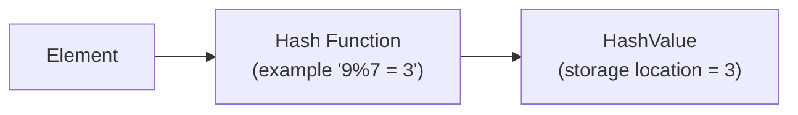
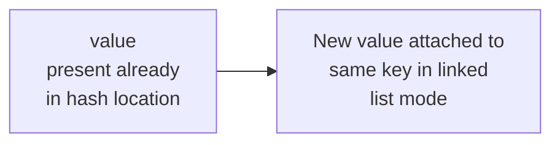

Hashing is a technique of mapping a large range of data to a small amount of space

It can also be used as the problem of key, value pair

<table>
    <tr><td></td></tr>
    <tr><td></td></tr>
    <tr><td></td></tr>
    <tr><td>9</td></tr>
    <tr><td></td></tr>
    <tr><td></td></tr>
    <tr><td></td></tr>

</table>



If there is already a value at a particular solution, if the hash function points to the same location for
a new element, a collision occurs.

How to avoid collisions ?

One way to avoid collision, is to maintain a linked list at that particular position. This is called `chaining` as described in the below figure



The probability of collisions in hash functions are minimal in standard libraries

Hash tables are dynamic data structures

When the load factor is breached , the rehashing has to be done in a hash table

O(1) amortized time complexity for retrieval and insertion

**Optimization in chaining**

In some cases the chaining may cause increase in the time complexity for insertion and retrieval.

One way to get around this is to use balanced binary search tree , instead of linked list, the improvement from $O(L)$ to $O(log(L))$

**Ordered Map** is implemented is using Tree Map (Binary search tree)

**Problems**
Given an integer array of size `N` and Q queries , Every query is a single integer `x`, print true, if x is present in array else print false

```python

def answerQueries(arr:list, Q:list):

    dtn = {x:True for x in arr}
    ans =  []
    for q in Q:
        ans.append(dtn.get(q, False))
    return ans

```

Given an integer ARR[N] and X, return True if a pair with sum==X exists

```python

def getPairSum(arr:list, x:int):

    dtn = {}
    for el in arr:
        dtn[el] = dtn.get(el, 0)+1
    for el in arr:
        if dtn.get(x-el):
            f = dtn.get(x-el)
            if el==x-el && f>1:
                return True
            else:
                return True
    return False

```

Can we do the above code in single for loop ?

```python

def getPairSum(arr:list, x:int):
    dtn = {}
    for el in arr:
        if dtn.get(x-el,0):
            return True
        dtn[el] = dtn.get(el, 0)+1
    return False


```

Given an integer array check if there is a subarray with sum = 0

```python

arr =[6, -1, 2, 1, -1]
def checkSubarraySum(arr:list):
    psum = 0
    dtn = {}
    dtn[psum]=1
    for i in range(len(arr)):
        psum+=arr[i]
        if dtn.get(psum):
            return True
        dtn[psum] = 1
    return False


```

Given an integer ARR[N] , find the length of largest subarray with sum = 0

```python
arr = [2, 1, 4, -3, -2, 3, -1, -2, 6]
def largestSubArray(arr:list):
    psum = 0
    ans = 0
    dtn = {}
    dtn[psum]=-1
    for i in range(len(arr)):
        psum+=arr[i]
        if not dtn.get(psum):
            dtn[psum] = i
        else:
            ans = max(ans, i-dtn[psum])
    return ans


```

Given an integer ARR[N] count number of subarrays with sum = k

```python
arr =[2,1, 4, -1, 0]
def countSubarray(arr:list, k:int):
    prefix_sum = arr[i]
    dtn = {}
    cnt = 0
    dtn[prefix_sum] = 1
    for i in range(len(arr)):
        prefix_sum+=arr[i]
        if dtn.get(prefix_sum-k):
            cnt+=dtn[prefix_sum-k]
        dtn[prefix_sum]+=1
    return count
```

Given an integer ARR[N], check if it contains consecutive elements.

```python

[13, 16, 12, 15, 14]
def checkConsecutive(arr:list):
    mine = min(arr)
    dtn = {}
    for n in arr:
        dtn[n]=1
    for i in range(mine, mine+len(arr)):
        if not dtn.get(i):
            return False
    return True

```

**Longest consecutive sequence**

Given an integer array, Find the length of longest consecutive sequence .

We can solve this problem, using left streak and right streak.

Consider the example

2, 3, 4 .......... 6, 7, 8, 9

...............................
....3...................4......

Now when we encounter a new element `5` the streak basically has to change

5 = (1+ left streak + right streak ) which is `1+3+4`

Now the streak of `2` and `9` should also be changed to `8`

```python

[10, 3, 7, 9, 5, 4, 16, 20, 6, 5, 19]

def longestConsecutiveSequence(arr:list):

    ans = 0
    dtn = {}
    for i in range(len(arr)):
        if dtn.get(arr[i]): continue
        else:
            ls , rs =  0, 0
            if dtn.get(arr[i]-1):
                ls = dtn.get(arr[i]-1)
            if dtn.get(arr[i]+1):
                rs = dtn.get(arr[i]+1)
            ans = max(ans, 1+ls+rs)
            dtn[arr[i]] = 1+ls+rs
            dtn[arr[i]-1] = 1+ls+rs
            dtn[arr[i]+1] = 1+ls+rs
    return ans
```

How to solve the exactly same problem as above with another approach.

Simple Intution : If my current element is `x` then `x` is the starting element of the streak if `x-1`
is in the map and then we find the length of the streak.

```python

arr = []
def longestConsecutive2(arr:list):
    dtn = {}
    visited = {}
    for i in range(len(arr)):
        dtn[arr[i]]=1

    ans = 0
    for i in range(len(arr)):
        if dtn.get(arr[i]-1):
            continue
        if visited.get(arr[i]):
            continue
        visited[arr[i]]=1
        len = 0
        x = arr[i]
        while dtn.get(x):
            len+=1
            x+=1
        ans = max(ans, len)
    return ans
```

Given an integer matrix mat[M][N] of 0's and 1's , Transform the matrix such that if mat[i][j]=1

then all the `ith` row should be made `1s` and make `jth` column should be made `1s`

```python

def boolMat(mat):
    m = len(mat)
    n = len(mat[0])
    row = [0]*m
    col = [0]*n

    for i in range(m):
        for j in range(n):
            if mat[i][j]==1:
                row[i]=1
                col[j]=1
    for i in range(m):
        for j in range(n):
            if row[i]==1 or col[j]==1:
                mat[i][j]=1
    return mat

```

Given an boolean matrix of N\*N if $mat[i][j] == 1$ , all the rows and columns and diagonal that pass through this point should be made 1

Solution

1. Create a rowMap : i, and ColMap j
2. MajDiaMap i1-j1, MinDiaMap i1+j1

```python

def boolMat2(mat):
    n = len(mat)
    row = {}
    col = {}
    maj = {}
    min = {}

    for i in range(n):
        for j in range(n):
            if mat[i][j]==1
                row[i]=1
                col[j]=1
                maj[i-j]=1
                min[i+j]= 1
    for i in range(m):
        for j in range(n):
        if row[i]==1 or col[j]==1 or maj[i-j]==1 or min[i+j]==1:
            mat[i][j]=1
    return mat
```

**Maximum points on same line**

There are N points on x-y plane , find maximum number of points lying along the same straight line.

Measure the slopes for point $P_i$ from $P_{i+1}$ to $P_{n-1}$ and store this slopes in map.

make key as $\delta x , \delta y$

```python
from typing import List

def standardise(num, den):
    if num == 0 : den=0
    elif den == 0 : num=0
    elif num<0 and den<0:
        num*=-1
        den*=1
    return num , den


def gcd(val1:int, val2:int):
    if val1==0: return val2
    elif val2 == 0 return val1
    else:
        m1 = max(val1 , val2)
        m2 = min(val1, val2)
        if m1%m2==0 return m2
        return gcd(m1%m2, m2)
def getMaxPoints(points : List[List]):
    if not len(points):
        return 0
    ans = 1
    for c in range(len(points)):
        pi, pj = points[c]
        overlapping_points = 0
        map_slope = {}
        maxm = 0
        for j in range(c+1, len(points)):
            pid pjd = points[j]
            if pi == pid and pj==pjd:
                overlapping_points+=1
            else:
                idiff = pid-pi
                jdiff = pjd -pj
                m = gcd(abs(idiff), abs(jdiff))
                dx, dy  = xdiff/g, ydiff/g
                dx, dy = standardise(dx, dy)
                if map_slope.get([dx, dy]):
                    map_slope[[dx, dy]]+=1
                else:
                    map_slope[[dx,dy]]=1
                maxm = max(maxm, map_slope[[dx, dy]])
        ans = max(ans, maxm+overalapping_points+1)
    return ans

```

Given a string S :`"aababbaabbaaa"` and array of words `["ab", "ba", "ab"]`
Find starting indices of all substrings in `S` that contain all the words from array in any order

```python
def findSubstrings(S:str, words:list):
    ans = []
    if len(s) == 0 or len(words)==0 or len(words)* len(words[0]):
        return ans

    word_freq = {}
    for i in range(len(words)):
        word_freq[words[i]] = word_freq[words[i]]+1 if word_freq.get(words[i]) else 1
    n, l  = len(words), len(words[0])
    str_len = len(S)
    for i in range(S-n*l):
        tmp = {}
        for j in range(i, i+n*l, l):
            tmp[S[j:j+l]] = temp[S[j:j+1]]+1 if tmp.get([S[j:j+1]]) else 1
        flag = 1
        for j in range(n):
            if tmp.get(words[j]) or tmp[words[j]]!= word_freq[words[j]]
                flag = 0
                break
        if flag == 1:
            ans.append(i)
    return ans


```

Given a list of words , all the words are unique, find all pairs of indices , find all pairs of indices (i,j)
such that words[i]+words[j] forms a palindrome

[xyz, p, zyx, srp, ppprr]

```python
def getPairs(words:list):
    wordslen = len(words)
    word_map = {}
    for i in range(wordslen):
        word_map[words[i]] = i
    m = {}
    ans = []
    for i in range(wordslen):
        if word_map.get("") and word_map.get("")!=i and isPal(words[i], 0, len(words[i])-1) and m.get((i, word_map[""])):
            m[(i, word_map[""])] = True
            m[(word_map[""], i)] = True
            ans.append([i, word_map[""]])
            ans.append([word_map[""], i])
        for j in range(len(words[i])):
            prefix = words[i][:j+1]
            if word_map.get(prefix) and word_map.get(prefix)!=i and isPal(words[i], j+1, len(words[i])-1) and m.get((i, word_map[prefix])):
                m[(i, word_map[prefix])] = True
                ans.append([i, word_map[prefix]])
        for j in range(len(words[i])-1, -1, -1):
            suffix = words[i][j:len(words[i])-j]
            if word_map.get(suffix) and word_map.get(suffix)!=i and isPal(words[i], 0, j-1) and m.get((word_map[suffix], i)):
                m[(word_map[suffix], i)] = True
                ans.append([word_map[suffix], i])

def isPal(word, i:int, j:int):
    while i<j:
        if word[i]!=word[j]: return False
        else:
            i+=1
            j-=1
    return True
```
