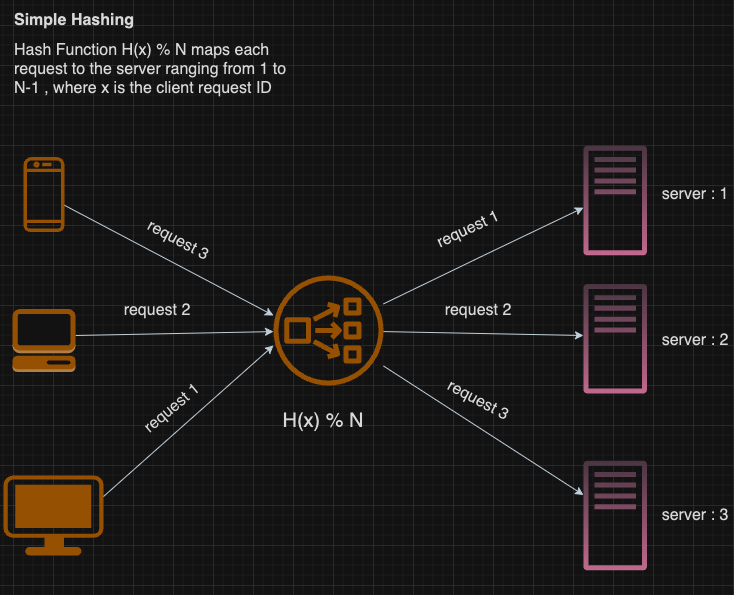

Why Load Balancing ?

1. It distributes client requests across multiple servers ensuring that no server is overworked. This ensures high availability of the system.

2. It reduces the response time of our system since our servers are not overworked our performance is not degraded.

**Load balancing Algorithms**

1. **Simple Hashing**

For the same input , hash function always gives the same output.
So the same client request is directed to the same server. To improve the performance each server uses cache to store relevant information.
if client `x` is directed to server `y` then `y` will cache some data of `x`

But if we add a new server then $H(x)\%(N+1)$ will reroute same requests to different servers and cache has to be recalculated everytime whenever add a new server which is very inefficient.

2. **Consistent Hashing**

3. **Round Robin**

4. **Weighted Round Robin**

5. **Least Connection**

6. **Weighted Least Connection**

There are N servers , Each server is labelled 0 to N-1

