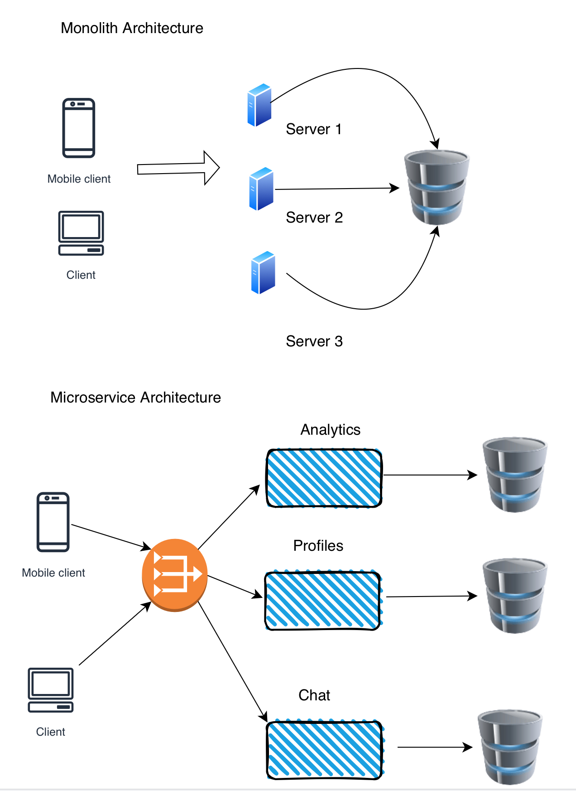

**Monolith**

1. Although it may have multiple servers , logically one big machine
   where all the services are present with no decoupling.
2. Good for Small Teams
3. Less complex
4. Faster ( because no remote procedure calls)
5. More context required for new developers , since everything is connected
6. Deployments and tests are complicated
7. Too much responsibility on each server

**Microservce**

1. Easier to scale
2. Easier for new team members
3. Parallel development can happen
4. For larger systems , microservice architecture is often used.
