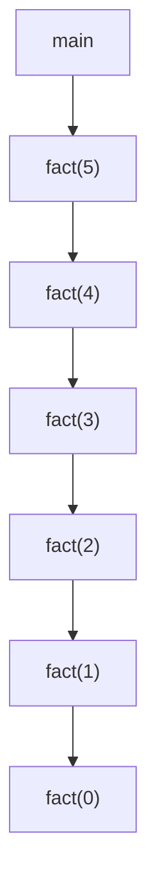
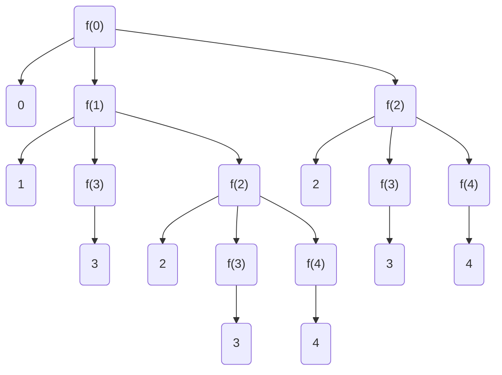
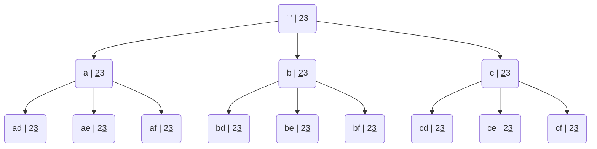
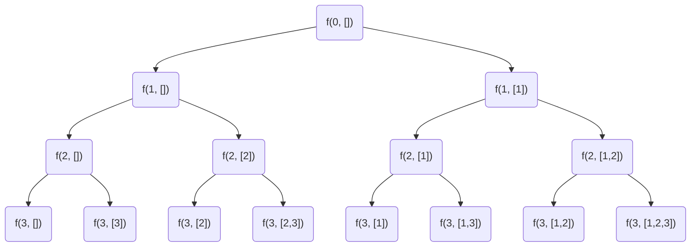
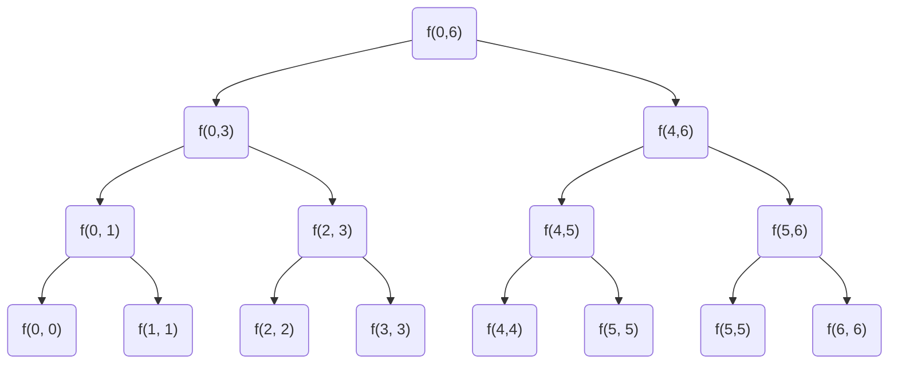
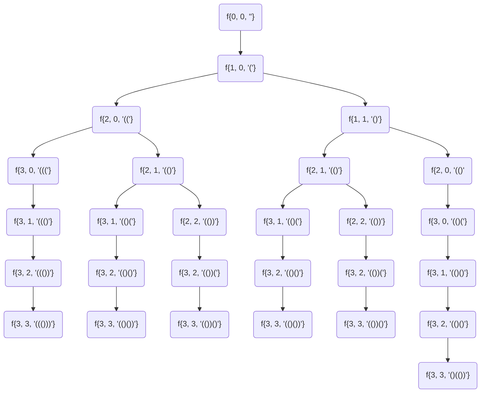
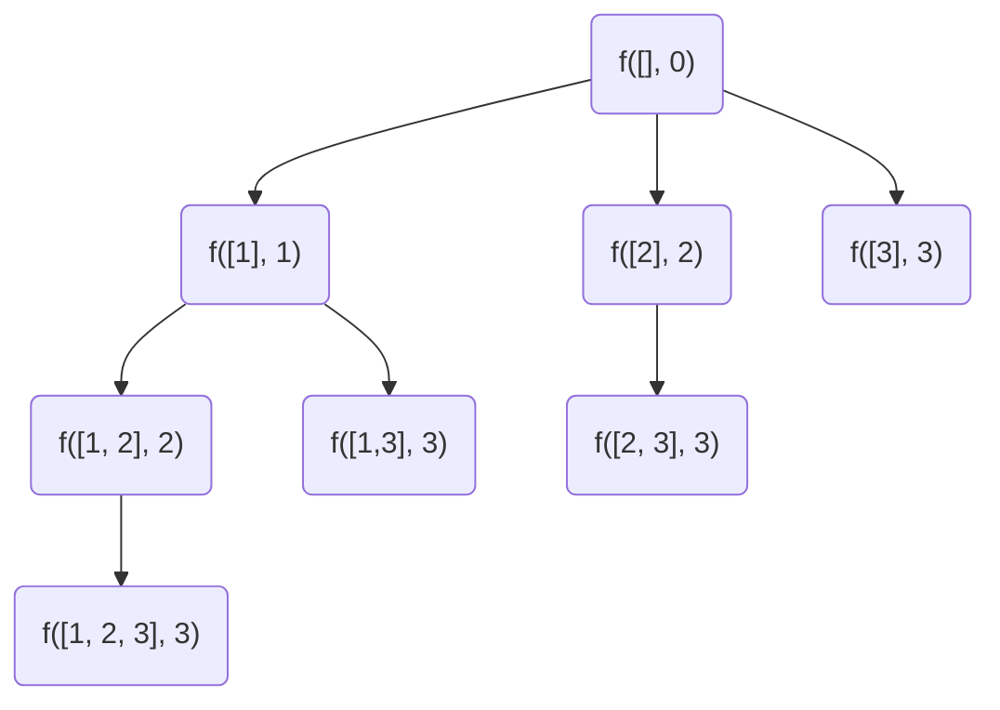
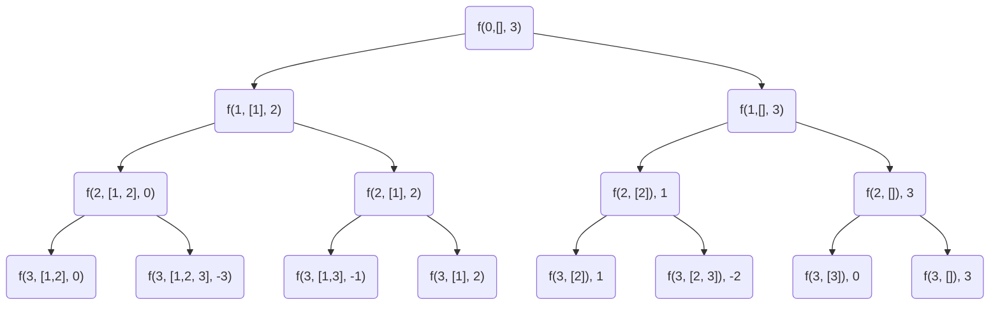
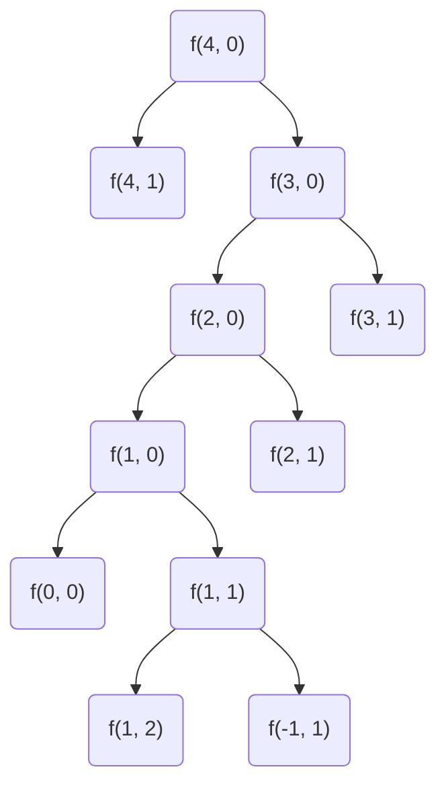

A process in which a function keeps calling itself is known as recursion and the corresponding function is called a recursive function. There are two important components to write a recursive function -

1. Recurrence relation - Break a larger problem to a smaller problem
2. Termination condition

Control Flow

```python
def fact(N:int):
	if N == 0: return 1
	return N * fact(N-1)
```



This is top to bottom (depth first) , the return happens in bottom to top fashion. The first function to return is the bottom (LIFO) . This is called stack.

Time complexity : O(n) -> n push operations and n pop operations

Space complexity : O(n) -> Recursion stack memory

This type of recursion is called single branch recursion.

```python
def func(x : int):
	print(x)
	if x>=3:
		return
	func(x+1)
	func(x+2)

if __name__ == "__main__":
	func(0)
```

The above snippet of code is for multi branch recursion

**Recursion Tree Diagram**



Print numbers from 1 to N

```python
# Given N print 1 -> N using recursion
def f(x:int, n:int):
	if x > n:
		return
	print(x)
	f(x+1, n)

f(1, 10)


# with a single variable.
def f(n:int):
	if n == 0:
		return
	f(n-1)
	print(n)

f(10)
```

Given a m \* n Grid

Destination : (m-1, n-1)

Need to reach (0, 0) --> (m-1, n-1)

How many distinct paths ? Given Constraints : 1. 1 Unit right and 1 Unit Bottom

| (0, 0) | -   | -      |
| ------ | --- | ------ |
| -      | -   | (m, n) |

`Recurrence relation : CountPaths(i,j) = CountPaths(i,j+1) + CountPaths(i+1,j)`

`Termination condition : if i == m-1 or j == n-1  return 1`

```python
def CountPaths(i:int, j:int, m:int, n:int):
	if i == m -1 or j==n-1:
		return 1
	return CountPaths(i+1,j, m,n) + CountPaths(i, j+1, m, n)

CountPaths(0,0, 3,3)
```

Time Complexity : O($2^ {m + n}$)

The height of the binary tree is m + n (since every root to leaf path has n right moves and m bottom moves , so total height is m + n)

Now every node has two nodes

total nodes = $1 + 2+ 4 .....2^{i-1} = 2^i$ , Now i is nothing but height of the tree which is O($2^{m+n}$)

CountPaths Alternate solution - I

```python
count =0
def helper(m:int, n:int):
	def countPaths(i:int, j:int):
		global count

		if i == m-1 or j == n-1:
			count=count+1
			return

		countPaths(i, j+1)
		countPaths(i+1, j)

	countPaths(0, 0)

	return count

helper(3, 3)
```

CountPaths Alternate solution - II

Make the source fixed and travel from 0,0 to reach i, j

```python
def countPaths(i:int, j:int):
	if i == 0 or j == 0:
		return 1
	return countPaths(i-1, j) + countPaths(i, j-1)

print(countPaths(m-1, n-1))
```

**Letter combinations**

    2 - abc
    3 - def
    4 - ghi
    5 - jkl
    6 - mno
    7 - pqrs
    8 - tuv
    9 - wxyz

digits = '23'
output = [ad, ae, af, bd, be, bf, cd, ce, cf]



```python
digitMap = [['a', 'b', 'c'],
			['d', 'e', 'f'],
			['g', 'h', 'i'],
			['j', 'k', 'l'],
			['m', 'n', 'o'],
			['p', 'q', 'r', 's'],
			['t', 'u', 'v'],
			['w', 'x', 'y', 'z']]

def printAllCombs(tmp:str, digits:str, i:int, digitMap:list):

	if len(tmp) == len(digits):
		print(tmp)
		return

	for ch in digitMap[ord(digits[i]) - ord('2')]:
		printAllCombs(tmp+ch, digits, i+1, digitMap)

printAllCombs("", "23", 0,digitMap )
```

Use character list to avoid extra space, since the extra space is due to the string being created each time and its pass by value.

```python
digitMap = [['a', 'b', 'c'],
			['d', 'e', 'f'],
			['g', 'h', 'i'],
			['j', 'k', 'l'],
			['m', 'n', 'o'],
			['p', 'q', 'r', 's'],
			['t', 'u', 'v'],
			['w', 'x', 'y', 'z']]

def printAllCombs(tmp:list, digits:str, i:int, digitMap:list):

	if len(tmp) == len(digits):
		print(''.join(tmp))
		return

	for ch in digitMap[ord(digits[i]) - ord('2')]:
		tmp.append(ch)
		printAllCombs(tmp, digits, i+1, digitMap)
		tmp.pop()

temp = []
printAllCombs(temp, "23", 0,digitMap )
```

**Subsets**

Generate all the subsets of a given array

input = [1, 2, 3]

output = \[[1, 2, 3], [1,2], [1,3], [1], [2,3], [2], [3], []]

Think in the manner of inclusion exclusion



```python
def subsets(tmp:list, i:int, input_:list):
	if i == len(input_):
		print(tmp)
		return

	tmp.append(input_[i])
	subsets(tmp, i+1, input_)
	tmp.pop()
	subsets(tmp, i+1, input_)

temp = []
subsets(temp, 0, [1,2,3])
```

Time complexity : O($2^N$) : Since there will be $2^{N}$ leaf nodes (approximating the whole of the nodes

$$1 + 2 + 4 .....2^{N}   =  \frac{2^{N+1} -1}{(2-1)}$$

How to do the same thing with binary digits

Bit masking is used in such categories if you only have two decisions

```python
def subsets(input_list:list):
    n = len(input_list)
    to_bin = [f'{i:0{n}b}' for i in range(1,2**n)]
    output = []
    for z in to_bin:
        temp = []
        for x, y in zip(z,input_list):
            if x !='0':
                temp.append(y)
        output.append(temp)

    return output


subsets([1, 2, 3])

```

Divide and Conquer Paradigm

Given an integer array of size N , find the max element of the array.

[7,1,4,3,2,6,5]



```python

def get_max(arr:list, i:int, j:int):
    if i==j:
        return arr[i]
    m = (i+j)//2
    return max(get_max(arr, i, m), get_max(arr, m+1, j))

temp = [7,1,4,3,2,6,5]
get_max(temp, 0, 6)
```

Time Complexity : $N +  \frac{N}{2}  + \frac{N}{4}....1 = \log_{2}{N}$

**Fast Exponentiation**

Given a number N and integer k , find $N^k$

```python

def get_pow(n:int, k:int):
    if k==0:
        return 1

    res = get_pow(n,k//2)
    if k%2==0:
        return res * res
    else:
        return n * res * res
```

In each step k is getting reduced by 2 , so the height of tree is
$\log_2{k}$, time complexity is O($\log_2{k}$)

Now the idea will be what if we want to reduce it by thrice instead of twice

$n^k = n^{k/3} *  n^{k/3}* n^{k/3}$

$n^6 = n^{2} *  n^{2}* n^{2}$ --> remainder 0

$n^7 = n^{2} *  n^{2}* n^{2} * n$ --> remainder 1

$n^8 = n^{2} *  n^{2}* n^{2} * n^{2}$ --> remainder 2

time complexity O($\log_3{k}$) , Although the function calls are less
but the amount of work done is almost double in this case because of three remainders.

**Balanced Parenthesis**

Given N pairs of braces , print all pairs of balanced parenthesis.

For N = 3

    - ((()))
    - (()())
    - (())()
    - ()(())
    - ()()()

Cases

1. $Cnt('(') == Cnt(')')$ then next brace would be
   a. string is complete , do nothing
   b. if string is not completed, just add opening brace '('

2. $Cnt('(') > Cnt(')')$ then next brace could be
   a. if all opening braces are over then just add closing brace
   b. if opening braces are remaining then add opening brace as well as closing brace.

l = 0 , r = 0, s = ""



```python
def printbraces(N:int, l:int, r:int, i:int, s:str):
    if i == 2*N:
        print("".join(s))
        return

    if l == r:
        s[i] = '('
        printbraces(N, l+1, r, i+1, s)

    elif l>r:
        if l == N:
            s[i] = ')'
            printbraces(N, l, r+1, i+1, s)
        else:
            s[i] = '('
            printbraces(N, l+1, r, i+1, s)
            s[i] = ')'
            printbraces(N, l, r+1, i+1, s)

N = 3
s = ['' for i in range(2*N)]
printbraces(N, 0, 0 , 0, s)
```

**Lexicographic Order**

Given set = [1, 2, 3] , the lexicographic order is
[]
[1]
[1, 2]
[1, 2, 3]
[1, 3]
[2]
[2, 3]
[3]



```python
def lsubset(nums:list, i:int, temp:list):
    print([x for x in temp if x])

    if i == len(nums):
        return


    for k in range(i, len(nums)):
        temp[k] = nums[k]
        lsubset(nums, k+1, temp)
        temp[k] = None


nums =[1, 2, 3]
tmp = [None]*len(nums)
lsubset(nums, 0, tmp)
```

**Subset Sum**

Given integer Arr[N] and desired integer Sum , Find the counf of distinct subsets of array
with sum = Sum

input : [1, 2, 3]
sum = 3

output : 2 , because {1, 2}, {3}



````python
def subsetSum(nums:list, i:int, sum:int, cnt:list):
    if i == len(nums):
        if sum == 0:
            cnt[0]+=1
        return cnt

    subsetSum(nums, i+1, sum - nums[i], cnt)
    subsetSum(nums, i+1, sum,cnt)

cnt = [0]
subsetSum([1,2,3], 0,3, cnt)
print(cnt[0])```
````

Another approach without cnt variable

```python
def subsetSum(nums:list, i:int, _sum:int, cnt:list):
    if i == len(nums):
        return _sum == 0
    return subsetSum(nums, i+1, _sum - nums[i], cnt) + subsetSum(nums, i+1, _sum,cnt)
subsetSum([1,2,3], 0,3, cnt)
```

Instead of always terminating at the leaf nodes one optimization is to terminate
whenever the sum becomes zero and return. No because the rest of the elements can
be zero or negative and they might form a valid set.

Given an integer Arr[N] positive elements only , Given a integer sum , Count number
of the distinct combinations with sum = SUM, An element a[i] can be taken multiple times

Arr = [1,2]
Sum: 4

[1,1,1,1]
[1,1, 2]
[2, 2]



````python
def subsetSum(nums:list, i:int, _sum:int, cnt:list):
    if _sum<0:
        return 0
    if _sum == 0:
        return 1
    if i == len(nums):
        return 0
    return (subsetSum(nums, i, _sum - nums[i], cnt)
            + subsetSum(nums, i+1, _sum,cnt))
subsetSum([1,2], 0,4, cnt)```
````
