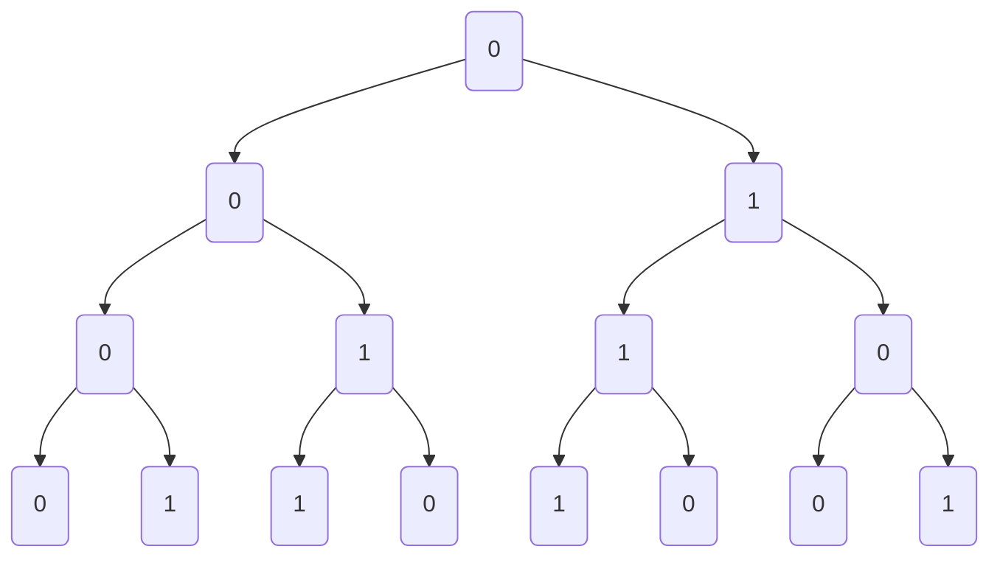

In searching there are two important elements

1. Search Key
2. Search Space

Lets say we have an integer array

<table>
    <tr>
        <td>5</td>
        <td>-1</td>
        <td>7</td>
        <td>0</td>
        <td>9</td>
    </tr>
</table>

is an example of search space and our search key for example would be `0`

```python
def search(arr:list, key:int):
    N = len(arr)
    for i in range(N):
        if arr[i] == key:
            return i
    return -1
```

Time complexity : $O(N)$
$T_N = T_{N-1} + O(1)$

A better approach to reduce the search space into half each time, this is called binary search.

```python
arr = [10,23,40,45,56,70,93,100,121]


def binarysearch(arr:list,key:int):
    N = len(arr)
    low = 0
    high = N-1
    while low<= high:
        mid = (low+high)//2
        if arr[mid] == key:
            return mid
        if arr[mid]>key:
            low = mid+1
        else:
            high = mid-1
    return -1

binarysearch(arr, 56)
# prints 4
```

Time Complexity : $O(log_{2}N)$

Some observations from the above scenario.

Given an integer array and key which is not present , whenever the while loop breaks , low will be greater than high.
what will be denoted by `arr[low]` and `arr[high]` For example consider the arr = [1, 10, 12, 21, 30] and key = 22
when the loop breaks here we have low = 4 and high = 3. That means arr[low] = 30 is next high value , and arr[high]=21 is next low value.

In short

`arr[low]` : just greater than key
`arr[high]` : just smaller than key

**First Occurence**

Given an integer arr of length N and key = 2 , find the first occurence

<table>
    <tr>
        <td>1</td>
        <td>1</td>
        <td>2</td>
        <td>2</td>
        <td>2</td>
        <td>3</td>
        <td>4</td>
        <td>4</td>
    </tr>
</table>

The repeated elements will be appearing in a chunk, since the array is sorted.

So your mid will be pointing either to the first index or rest of the indices. so we just write an extra condition

```python
    arr[m] and arr[m-1]!= key
        return m
    else:
        high = m-1
```

what if the occurence is first element of array, m-1 would be index out of bounds.

```python
def firstOccurence(arr:list, key:int):
    N = len(arr)
    h = N-1
    l = 0
    while l <= h:
        m = (l+h)//2

        if arr[m]>key:
            h = m-1
        elif arr[m]<key:
            l = m+1
        else:
            if m == 0:
                return m
            elif arr[m-1]!=key:
                return m
            else:
                h = m-1
arr = [1,1,2,2,2,3,4,4]
key = 2
firstOccurence(arr, key)
#output : 2

```

How to do the last occurence ?

```python
def lastOccurence(arr:list, key:int):
    N = len(arr)
    h = N-1
    l = 0
    while l <= h:
        m = (l+h)//2

        if arr[m]>key:
            h = m-1
        elif arr[m]<key:
            l = m+1
        else:
            if m == N-1:
                return m
            elif arr[m+1]!=key:
                return m
            else:
                l = m+1
arr = [1,1,2,2,2,3,4,4]
key = 2
lastOccurence(arr, key)
#output : 4
```

Given a sorted array , find the frequency of a repeated element in the array ?

Simple : First find last occurence, then first occurence , then you have $$l-f+1$$ as the frequency of that element.

**Sorted Rotated Array**

Given an sorted rotated array and distinct elements and find index of the key.

<table>
    <tr>
        <td>1</td>
        <td>2</td>
        <td>3</td>
        <td>4</td>
        <td>5</td>
        <td>6</td>
        <td>7</td>
    </tr>
</table>

It was initially sorted , but rotated to a certain extent.

<table>
    <tr>
        <td>5</td>
        <td>6</td>
        <td>7</td>
        <td>1</td>
        <td>2</td>
        <td>3</td>
        <td>4</td>
    </tr>
</table>

The observation from the above array is that even though the array is rotated , there are two parts to it which appear to be still sorted and we can individually use searching on these two parts.

How to find that index which seperates these two sorted arrays ?

That element is the maximum element of the array.

All the elements in the second chunk are less than `arr[n-1]` and all the elements in the first chunk are greater than `arr[n-1]`

pivot detection logic : `arr[m]>arr[m+1]`

```python
#Pivot detection run
if arr[m]<=arr[n-1]:
    h = m-1
elif arr[m]>arr[n-1]:
    l=m-1

```

```python
def get_pivot(arr:list):
    n = len(arr)
    l = 0
    h = n-1
    while l<=h:
        m = (l+h)//2
        if arr[m]<= arr[n-1]:
            h = m-1
        else:
            if arr[m]>arr[m+1]:
                return m
            else:
                l = m+1

arr = [5,6,7,1,2,3,4]
get_pivot(arr)
#output 2
```

**Peak Element**

<table>
    <tr>
        <td>10</td>
        <td>20</td>
        <td>15</td>
        <td>2</td>
        <td>23</td>
        <td>90</td>
        <td>67</td>
    </tr>
</table>

Here 20 and 23 Peak elements, Find any one peak element from the array.

The intuition here is choose the mid element see if its a peak , if its not , choose the direction in which the adjacent element is greater than mid element.

The reasoning behind that is , if you move in the increasing direction , there is guaranteed to find a peak element as apposed to the decreasing case.

```python

def get_peak_element(arr:list):
    n = len(arr)
    l = 0
    h = n-1
    while l<=h:
        m = (l+h)//2
        if m==0:
            if arr[m]> arr[m+1]:
                return m
        elif m == n-1:
            if arr[m]>arr[m-1]:
                return m
        elif arr[m]>arr[m-1] and arr[m]>arr[m+1]:
            return m
        elif arr[m-1]>arr[m]:
            h = m-1
        else:
            l = m+1

arr = [10,20,15,2,23,90,67]
get_peak_element(arr)
#output : 1
```

**Repeated element**

Given a sorted integer array of size greater than 2 , Any element of the array can only in between 1 to N-1
All elements come once and just one element comes twice. Find that element that comes twice .

<table>
    <tr>
        <td>1</td>
        <td>2</td>
        <td>3</td>
        <td>4</td>
        <td>5</td>
        <td>5</td>
        <td>6</td>
        <td>7</td>
    </tr>
</table>
idx
<table>
    <tr>
        <td style ="color:green">0</td>
        <td style ="color:green">1</td>
        <td style ="color:green">2</td>
        <td style ="color:green">3</td>
        <td style ="color:green">4</td>
        <td style ="color:red">5</td>
        <td style = "color:red">6</td>
        <td style = "color:red">7</td>
    </tr>
</table>

$A[i]==i+1$ is the first part and second part has pattern $A[i]==i$

```python
def get_repeat_element(arr:list):
    n = len(arr)
    l = 0
    h = n-1
    while l<=h:
        m = (l+h)//2
        if arr[m] == m:
            h = m-1
        else:
            if arr[m+1]==arr[m]:
                return arr[m]
            else:
                l = m+1

arr = [1,2,3,4,5,5,6,7]
get_repeat_element(arr)
#output : 5
```

**Single Element**

Given an unsorted array , all the elements come in pair , there is a element which comes only once.

<table>
    <tr>
        <td style ="color:green">4</td>
        <td style ="color:green">4</td>
        <td style ="color:green">1</td>
        <td style ="color:green">1</td>
        <td style ="color:red">3</td>
        <td style ="color:blue">7</td>
        <td style = "color:blue">7</td>
        <td style = "color:blue">6</td>
        <td style = "color:blue">6</td>
    </tr>
</table>

<table>
    <tr>
        <td style ="color:green">e</td>
        <td style ="color:green">o</td>
        <td style ="color:green">e</td>
        <td style ="color:green">o</td>
        <td style ="color:red">e</td>
        <td style ="color:blue">o</td>
        <td style = "color:blue">e</td>
        <td style = "color:blue">o</td>
        <td style = "color:blue">e</td>
    </tr>
</table>

So after the single element appears the index changes from even odd to odd even.

```python
def get_single_element(arr:list):
    n = len(arr)
    l = 0
    h = n-1
    if l==h:
        return arr[0]
    while l <= h:
        m = (l+h)//2
        if m == 0:
            if arr[m]!= arr[m+1]:
                return a[m]
            else:
                l = m+1
        elif m == n-1:
            if arr[m-1]!=arr[m]:
                return arr[m]
            else:
                h = m-1
        elif arr[m]!=arr[m-1] and arr[m]!= arr[m+1]:
            return arr[m]

        else:
            if arr[m]==arr[m-1]:
                fo = m-1
                so = m
            else:
                fo = m
                so = m+1

            if fo%2==0:
                l = m+1
            else:
                h = m-1

arr = [4,4,1,1,3,7,7,6,6]
get_single_element(arr)
#output : 3
```

**Monotonic Functions**

`Non Decreasing`: As the input increases , the output increases or remains the same.
`Non Increasing`: As the input increases , the output decreases or remains the same.

A function is given and integer denoting `k` is given , find a point `x` such that $f(x) = k$

For non decreasing function $x^| <= x^{||}$ then $f(x^|) <= f(x^{||}) $
For non increasing function $x^| <= x^{||}$ then $f(x^|) >= f(x^{||}) $

$f(m) > k$ --> move left
$f(m) < k$ --> move right

_Bottom line_ : You have to find a sorted space and then apply binary search

**Square root**

Given a non negative number , find the square root of N

$N = 36$ , $\sqrt{36} = 6$

But all square roots do not have perfect square. if square root is not a perfect square , return the floor value of square root

Here $y = x^2$ is monotonic for `x` > 0

$f(x) : x^2 < N$ , here your $l = 0, h = N$ and do binary search

```python

def squareroot(n:int):
    l = 0
    h = n
    while l<=h:
        m = (l+h)//2
        if m*m > n:
            h = m-1
        else:
            if (m+1) * (m+1)> n:
                return m
            else:
                l = m+1
print(squareroot(36)) # prints 6
print(squareroot(10)) # prints 3
```

**K-th Smallest Element**

Technique from previous problem : Binary search on answer, first you figure out the range of the answer then apply binary search

Given an unsorted integer array and given integer k , find the k-th smallest element.

k-th smallest : when you sort an input array , the kth position element is the k-th smallest.

<table>
    <tr>
        <td style ="color:green">40</td>
        <td style ="color:green">10</td>
        <td style ="color:green">10</td>
        <td style ="color:green">30</td>
        <td style ="color:green">40</td>
        <td style ="color:green">20</td>
        <td style = "color:green">50</td>
        <td style = "color:green">70</td>
        <td style = "color:green">50</td>
    </tr>
</table>

Sort the array.

<table>
    <tr>
        <td style ="color:green">10</td>
        <td style ="color:green">10</td>
        <td style ="color:green">20</td>
        <td style ="color:green">30</td>
        <td style ="color:green">40</td>
        <td style ="color:green">40</td>
        <td style = "color:green">50</td>
        <td style = "color:green">50</td>
        <td style = "color:green">70</td>
    </tr>
</table>

Now the $k = 6^{th}$ element is 40

Now lets say the array is the read only array, what will be the approach to follow.

Intuiton : The element x which is kth element => there are k elements smaller than x.

$cnt < k$ then x is not the ans
$cnt >= k$ then x is the ans.

There will be many elements whose cnt is greater than k , but the ans would have the count which would have strictly smaller count less than k.

```python
def get_kth_smallest(arr:list, k:int):
    n = len(arr)
    for i in range(n):
        smaller = 0
        equal = 0
        for j in range(n):
            if arr[j]<arr[i]: smaller+=1
            elif arr[j] == arr[i]: equal+=1
        total = smaller+equal
        if total>=k and smaller<k:
            return arr[i]

arr = [40,10,10,30,40,20,50,70,50]
get_kth_smallest(arr, 6) # prints 40
```

Time complexity : $O(N^2)$

How to optimize it ?

use binary search with monotonic function

```python

def count_monotonic(arr:list, x:int):
    cnt = 0
    n = len(arr)
    for i  in range(n):
        if arr[i] <= x:
            cnt+=1
    return cnt


def get_kth_smallest(arr:list, k:int):
    n = len(arr)
    l = min(arr)
    h = max(arr)
    while l<=h:
        m = (l+h)//2

        cnt = count_monotonic(arr,m)
        if cnt < k :
            l = m+1
        else:
            cnt_m1 = count_monotonic(arr, m-1)
            if cnt_m1 < k:
                return m
            else:
                h = m-1

arr = [40,10,10,30,40,20,50,70,50]
get_kth_smallest(arr, 6) # prints 40
```

Time complexity $O(n\log_{2}(max-min))$

Given an n \* n matrix , each row is sorted in ascending order, find the k-th smallest element of that matrix.

<table>
    <tr>
        <td style ="color:green">1</td>
        <td style ="color:green">3</td>
        <td style ="color:green">5</td>
        </tr>
    <tr>
        <td style ="color:green">1</td>
        <td style ="color:green">2</td>
        <td style ="color:green">9</td>
    </tr>
    <tr>
        <td style = "color:green">4</td>
        <td style = "color:green">5</td>
        <td style = "color:green">6</td>
    </tr>
</table>

Brute Force : Copy the elements in an list and sort them and find the kth element.

Time Complexity : $O(N^2\log(N^2)) = O(N^2 \log N)$

Optimized Approach : The min and max are high and low and then we can solve by copying into a temp array.

Time Complexity : $N^2 \log(N)$

So we have to optimize monotonic functions complexity, the idea is use binary search on the sorted row to find the count

Time Complexity : $N\log N * \log_{2} (MAX-MIN)$

```python

def binarysearch(arr:list, low:int, high:int, value:int):
    while low<=high:
        mid = (low+high)//2
        if arr[mid] <= value:
            low = mid+1
        elif arr[mid]>value:
            high = mid-1

    return low # Return the index of the first element greater than or equal to value


def count_monotonic(arr:list, x:int):
    count = 0
    n = len(arr)
    for row in arr:
        count+= binarysearch(row, 0, n-1, x)
    return count


def get_kth_smallest(arr:list, k:int):
    n = len(arr)
    l = min([x[0] for x in arr])
    h = max([x[n-1] for x in arr])
    while l<=h:
        m = (l+h)//2

        cnt = count_monotonic(arr,m)
        if cnt < k :
            l = m+1
        else:
            cnt_m1 = count_monotonic(arr, m-1)
            if cnt_m1 < k:
                return m
            else:
                h = m-1

arr = [[1,3,5],
       [1,2,9],
       [4,5,6]]

get_kth_smallest(arr, 6) # prints 5
```

Given an integer unsorted array of size N , it contains positive numbers only.
also given another integer x>=0 , Find maximum possible k , such that none of the subarraays of size k has a sum >x

The range of k is 0 to N, use binary search to find the maximum k

```python
def isPoss(arr:list, m:int, x:int) -> bool:
    n = len(arr)
    _sum = 0
    for i in range(m):
        _sum+=arr[i]

    if _sum > x:
        return False

    s = 0 ; e = m

    while e < n:
        _sum-=arr[s]
        s+=1
        e+=1
        if e>=n:
            break
        _sum+=arr[e]
        if _sum>x:
            return False

    return True

def get_maximum_possible(arr:list, x:int):
    n = len(arr)
    if sum(arr)<=x:
        return n
    low = 0
    high = n

    while low<=high:
        mid = (low+high)//2

        if not isPoss(arr,mid, x):
            high = mid-1
        else:
            if not isPoss(arr, mid+1, x):
                return mid
            else:
                low = mid+1

arr = [3,1, 2, 1]
x = 4

get_maximum_possible(arr, x)
```

A Farmer has N stalls, located at some points in a number line.
There are C cows , we want to place C cows in N stalls , so that
minimum distance between any two adjacent cows is maximum

Can I place all the `C` cows such that $adj\; dist >= d$

so what is the range of `d` ? `1 to N-1`

Apply binary search on this range.

```python
def isValid(m:int, c:int,arr:list) -> bool:
    n = len(arr)
    cnt = 1
    pre = arr[0]
    for i in range(1, n):
        if arr[i]-pre < m:
            continue
        else:
            cnt+=1
            pre = arr[i]
    return cnt >= c

def putcows(arr:list, c:int):
    n = len(arr)
    low = min(arr)
    high = max(arr)
    arr.sort()
    while low <= high:
        mid = (low+high)//2
        r = isValid(mid, c, arr)
        if not r:
            high = mid-1
        else:
            r1 = isValid(mid+1, c, arr)
            if not r1 :
                return mid
            else:
                low = mid+1
    return -1
arr = [1, 2, 4, 8, 9]
c = 2
putcows(arr, c)
# output : 8
```

Given `N` books of `p` pages , array denoting the pages and given `m` students

Allocate `N` books to `m` students

1. Each student should get atleast 1 book.
2. All the books should be alloted.
3. Allotment must be contiguos.

What is the minimum value of maximum number of pages that gets allocated to any student ?

Make pages as the variable and apply binary search on top of that.

````python
def isPossible(mid:int, arr:int, students:int)->bool:
    n = len(arr)
    cnt = 1
    _sum = 0
    for i in range(n):
        if (_sum + arr[i]>mid):
            cnt+=1
            _sum = arr[i]
        else:
            _sum+=arr[i]
    return cnt<=students

def get_min_max_pages(arr:list, students:int):
    n = len(arr)
    l = max(arr)
    h = sum(arr)
    while l<=h:
        m = (l+h)//2
        r = isPossible(m, arr, students)
        if not r:
            l = m+1
        else:
            r1 = isPossible(m-1, arr, students)
            if not r1: return m
            else:
                h = m-1
    return -1
arr = [12, 34, 67, 90]
get_min_max_pages(arr, 3)```
````

Given a number `N` , what is the smallest good base of that number ?

What is a good base ?

A particular base is called a good base of a number if all the digits of that number in that base are all `1's`

Example : For `3` , the good base is `2` since its represented as `11`

For N = 13 , $(111)_3$, $(11)_2$, $(111111111111)_1$

For any general `N` = $(11)_{N-1}$ is always a good base

In this question dont consider `1` as base

So just run binary search between 2 to N, and find the good base.

Another example N = 4681 = $(11111)_8$

_Solution_

Fix the number of digits and find the base representation by doing binary search from low = 2 to high = N-1

Since one of the constraint is that your max number is $10^{18}$ we can take max 63 digits

```python
def isGoodBase(base: int, numDigits: int, N: int):
    total = 0
    current = 1
    flag = False
    for k in range(numDigits+1):
        total += current
        if total>=N:
            break
        if k<numDigits and ((N - total) / current) < base:
            flag = True
            break
        current *= base
    return total, flag

def getSmallestGoodBase(N: int):
    for numDigits in range(63, 0, -1):
        l = 2
        h = N - 1
        while l <= h:
            m = (l + h) // 2
            baseSum, flag = isGoodBase(m, numDigits, N)
            if baseSum > N or flag:
                h = m - 1
            elif baseSum < N:
                l = m + 1
            else:
                return m
    return N - 1

# Example usage
print(getSmallestGoodBase(4681))  # Output: '8'
```

Family of Strings

Consider a family of strings,

$s[0] = 0$,
$s[i] = s[i-1]0s[i-1]^{'}$
$s[1] = 001$
$s[2] = 0010110$
$s[3] = 001011001101001$

Given two integers `n`, `k` what is the $k^{th}$ character of $n^{th}$ string



Observation from the above graph is that whenever there is a right move the bit toggles , and whenever there is left move the bit remains the same

Based on this information , we can take the initial bit as `0` and then traverse in binary search mode, whenever we move left we dont change the bit , whenever we move right we toggle the bit

```python

def familyStrings(n:int, k:int):
    bit = 0
    low = 0
    high = (2**(n+1)) - 1
    while low<=high:
        mid = (low+high)//2
        if mid == k :
            return bit
        elif mid<k:
            bit = 1-bit
            low = mid+1
        else:
            high = mid-1

familyStrings(3, 8)
#output : 1
```

Time Complexity $O(\log_{2}{2^{n+1}})$ = $O(n)$
