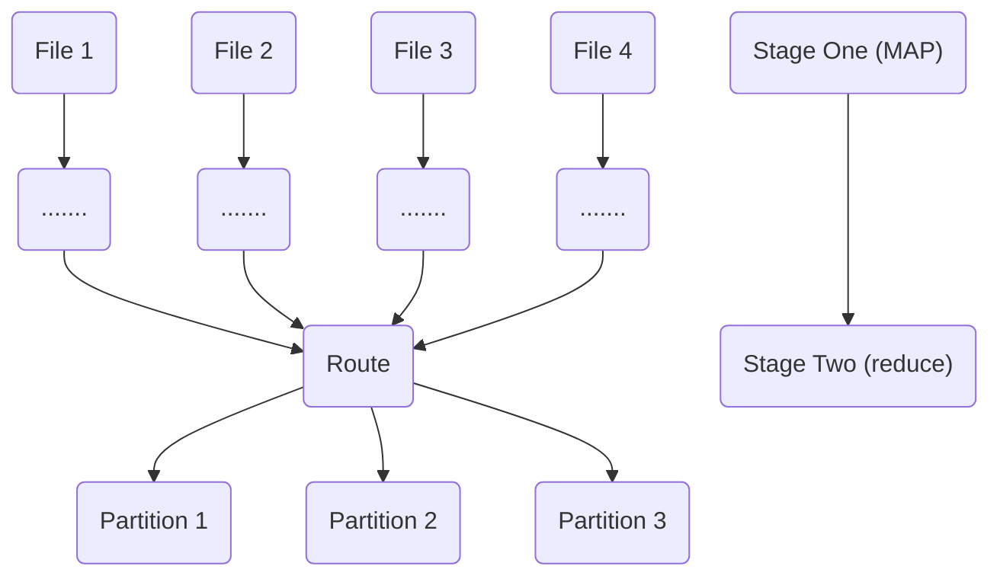

Why is spark so good ?

- Spark leverages RAM much more effectively than previous iterations of distributed compute (its way faster than Hive/Java MR/etc)

- Spark is storage agnostic , allowing a decoupling of storage and compute
  - spark makes it easier to avoid vendor lock-in
- Spark has a huge community of developers so stackoverflow/chatgpt will help you troubleshoot

When is spark not so good ?

- Nobody else in the company knows spark
  - spark is not immune to the bus factor
- Your company already uses something else a lot
  - Inertia is often times not worth it to overcome

How does spark work ?

- The plan
- The driver
- The executors

**The plan**

- This is the transformation you describe in python, scala or SQL
- The plan is evaluated lazily
  - Lazy evaluation : "execution only happens when it needs to"
- When does execution "need to " happen ?
  - writing output
  - when part of the plan depends on the data itself
    - (e.g calling dataframe.collect() to determine the next set of transformations)

**The Driver**

- The Driver reads the plan
- Important spark driver settings

<table>
    <tr>
        <td>
            spark.driver.memory
        </td>
        <td>
            For complex jobs or jbos that use dataframe.collect() , you may need to bumb this higher or else you'll experience an OOM
        </td>
    </tr>
    <tr>
        <td>
            spark.driver.memory.OverheadFactor
        </td>
        <td>
            What fraction the driver needs for non-heap related memory, usually 10%, might need to be higher for complex jobs 
        </td>
    </tr>
</table>

Expert Advice : Every other setting , we should not touch

- Driver needs to determine a few things

  - When to actually start executing the job and stop being lazy
  - How to join datasets
  - How much parallelism each step needs

**The executors**

- The driver passes the plan to the executors

<table>
    <tr>
        <td>
            spark.executor.memory
        </td>
        <td>
            This determines how much memory each executor gets. A low number here may cause Spark to spill to disk, which will cause your job to much solver
        </td>
    </tr>
    <tr>
        <td>
            spark.executor.cores
        </td>
        <td>
            How many task can happen on each machine (default is 4, shouldnt go higher than 6)
        </td>
    </tr>
    <tr>
        <td>
            spark.executor.memoryOverheadFactor
        </td>
        <td>
            What % of memory should an executor use for non-heap related tasks, usually 10%, For Jobs with lots of UDFs and complexity , you may need to bump this up !
        </td>
    </tr>

</table>

**The types of joins in spark**

- Shuffle sort-merge join
  - Default join strategy since spark 2.3
  - works when both sides of the join are lager
- Broadcast Hash join
  - Workes well if the left side of the join is small
  - spark.sql.autoBroadcastJoinThreshold (default is 10 MBs , can go as high as 8GBs, you'll experience weird memory problems > 1GBs)
  - A join without shuffle
- Bucket joins
  - A join without shuffle

**Shuffle sort-merge join flow**

In the first map step each file is mapped by the criteria(for example user_id % 2 to the partition)

Shuffle partitions and parallelism are linked

- Shuffle partitions and parallelism
  - spark.sql.shuffle.partitions and spark.default.parallelism
  - Just use spark.sql.shuffle.partitions , Since the other is related to the RDD API you shouldnt be using

At low to medium volume : Its really good and makes our lives easier

At high volumes > 10 TBs - painful - At netflix, shuffle killed the ip enrichment pipeline

Always bucket your partitions to be a power of 2

How to minimize shuffle at high volumes

- Bucket the data if multiple joins or aggregations are happening downstream
- Spark has the ability to bucket data to minimize or eliminate the need for shuffle when doing joins
- Bucket joins are very efficient but have drawbacks
- Main drawback is the initial parallelism = number of buckets
- Bucket joins only work if the two tables number of buckets are multiples of each other , always use power of 2

**Shuffle and Skew**
Sometimes some partitions have dramatically more data than others

- Not enough partitions
- Beyonce gets a lot more notifications than the average facebook user

**How to tell if your data is skew**

- Most common is a job getting to 99% , taking forever , and failing
- Another, more scientific way is to do a box plot

**Ways to deal with skew**

- Adaptive query execution only in spark3+
  - set spark.sql.adaptive.enabled = True
- Salting with group by : group by a random number, aggegate+group by again

**spark on databricks vs regular spark**

<table>
    <tr>
        <td></td>
        <td>Managed Spark ie Data bricks</td>
        <td>Unmanaged Spark ie Big Tech</td>
    </tr>
    <tr>
        <td>Should you use notebooks ?</td>
        <td>Yes</td>
        <td>Only proof of concepts</td>
    </tr>
    <tr>
        <td>How to test job ?</td>
        <td>Run the notebook</td>
        <td>spark-submit from CLI</td>
    </tr>
    <tr>
        <td>Version control</td>
        <td>Git or Notebook versioning</td>
        <td>git</td>
    </tr>

</table>

How to look at spark query plans

- Use explain() on your dataframes

  - This will show you the join strategies that will take

**Read Data**

- Lake
  - Delta lake, apache iceberg, hive metastore
- from rdbms
  - postgres, oracle etc
- from an api
  - make a rest call and turn into data
- from a flat file
  - csv, json

Spark output datasets

- Should almost always be partitioned on date
  - This is the execution date of the pipeline
  - In big tech this is called "ds partitioning"
