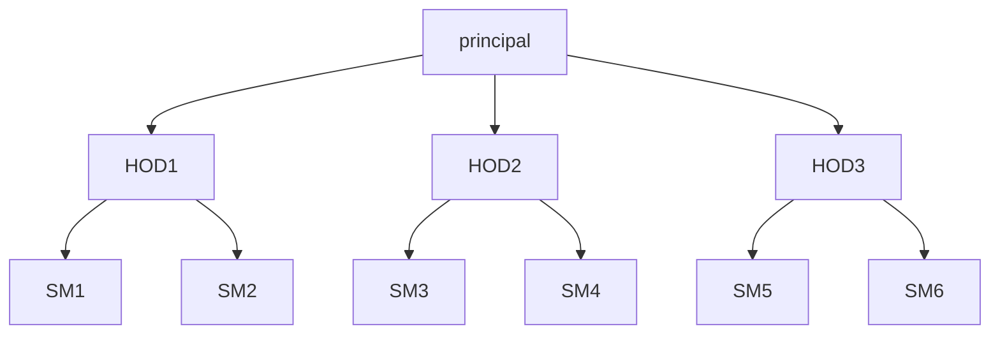
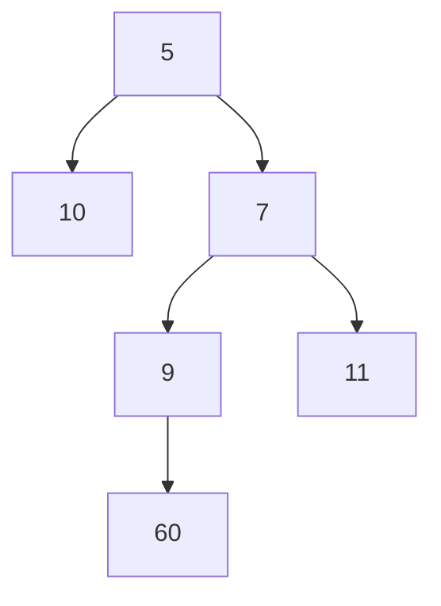
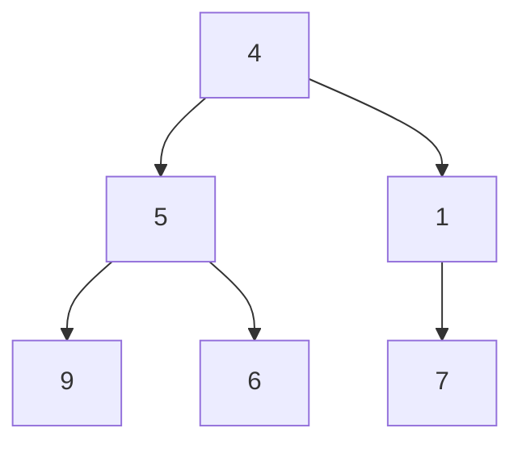
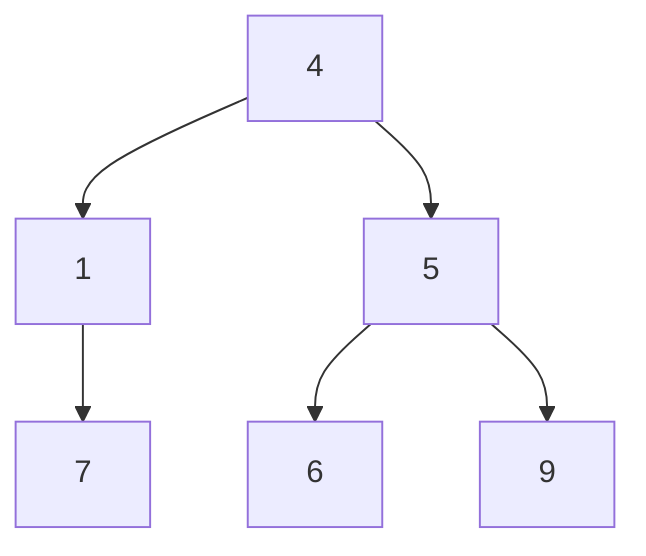
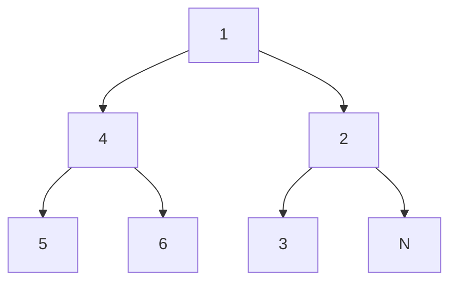
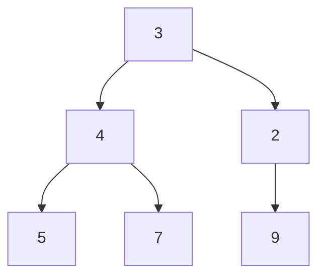
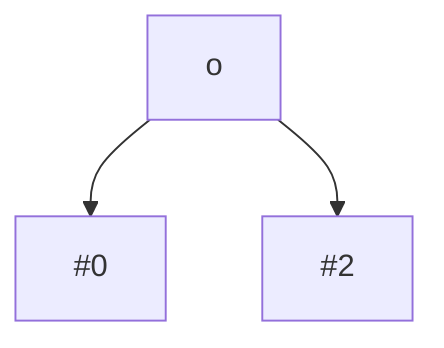
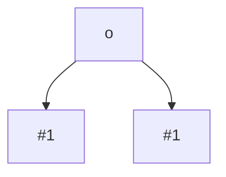
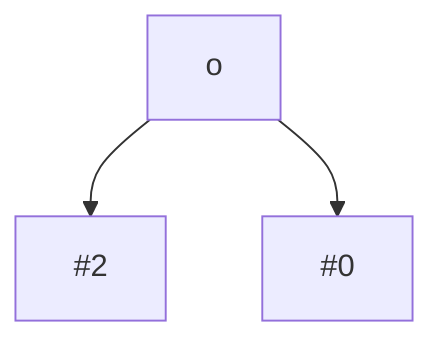

One of the most important topics in view of interviews

Trees are non-linear data structures. These are used to store
hierarchial data



The nodes which do not contain any children are called `leaf nodes`.

If the root to leaf path are smaller then complexity is smaller

Examples of tree structure

1. File structure

A Tree is a **acyclic**(no cycle) graph. Graph is nothing but of collection of edges and vertices

If a graph has **n** vertices then it will have **n-1** edges

**Rooted Vs Unrooted**

1. If edges are bidirectional then its called unrooted tree
2. If egdes are directed then its called rooted tree

**Skewed Tree**

Where all the nodes are arranged in a single straight line , similar to linked list

**Binary Tree**

A node can have maximum of 2 children

If there are n nodes in a binary tree , then the number of levels (or height) of the binary tree is : **$\log_{2}{n}$**

```python
class Node:
    def __init__(self, data, left=None, right=None):
        self.data = data
        self.left = left
        self.right = right
```

**`Given a root of a binary tree count total number of nodes.`**



Output : 6

```python
def countNodes(root:Node):
    if not root : return 0
    return 1 + countNodes(root.left)+countNodes(root.left)

```

- Time Complexity : $O(N)$

- Longest call stack (space complexity): Height of the tree : $O(N)$

**`Given a binary tree , count the number of leaves ?`**

- A Node with left and right as Null is a leaf node

```python
def countLeaves(root:Node):
    if not root : return 0
    if not root.left and not root.right : return 1
    return countLeaves(root.left) + countLeaves(root.right)
```

- Time Complexity : $O(N)$
- Longest call stack (space complexity): Height of the tree : $O(N)$

**`Given a binary tree , convert it into its mirror image`**



Mirror Image is



- Swap Left tree and right tree children
- Mirror(node.left)
- Mirror(node.right)

```python
def mirror(root:Node):
    if not root: return
    tmp = root.left
    root.left = root.right
    root.right = tmp
    mirror(root.left)
    mirror(root.right)
```

- Time Complexity : $O(N)$
- Longest call stack (space complexity): Height of the tree : $O(N)$

**`Given a binary tree , check if its symmetric`**

- If a tree is symmetric , then the mirror image is the same as the original tree
- In a symmetric tree , both left sub tree and right sub tree are equal

```python
def areMirrorImage(r1:Node, r2:Node):
    if not r1 and not r2:
        return True
    if not r1 or not r2:
        return False
    return r1.val == r2.val and areMirrorImage(r1.left, r2.right) and areMirrorImage(r1.right, r2.left)


def isSymmetric(root:Node):
    if not root:
        return True
    return areMirrorImage(root.left, root.right)
```

- Time Complexity : $O(N)$
- Longest call stack (space complexity): Height of the tree : $O(N)$

**`Given a binary tree , Get its height ?`**

- Height : Maximum length of root to leaf path

```python

def getHeight(root:Node):
    if not root:
        return 0
    lht = getHeight(root.left)
    rht = getHeight(root.right)
    return 1 + max(lht, rht)
```

- Time Complexity : $O(N)$
- Longest call stack (space complexity): Height of the tree : $O(N)$

**`Given a binary tree , Get its min height ?`**

- Minimum height means smallest root to leaf path
- Root to Null paths will result in errored output

- Just look at the below tree and do sample run



- Instead of returning `0` return infinity which would solve the problem in this case

```python

def getMinHeight(root:Node):
    if not root:
        return float("inf")

    if not root.left and not root.right:
        return 1

    lht = getMinHeight(root.left)
    rht = getMinHeight(root.right)
    return 1 + max(lht, rht)
```

- Time Complexity : $O(N)$
- Longest call stack (space complexity): Height of the tree : $O(N)$

**`Given a binary tree , print all the root to leaf paths`**



output

- 3, 4, 5
- 3, 4, 7
- 3, 2, 9

Use a combination of recursion and backtracking

```python

def printPaths(root:Node, tmp:list):
    if not root:
        return
    tmp.append(root.val)
    if not root.right and not root.left:
        print(tmp)
        return
    else:
        printPaths(root.left)
        printPaths(root.right)
    tmp.pop()
```

**`Given a binary tree , Find its diameter`**

- Longest path between any two nodes in the binary tree
- Diameter is the 1 + height of left sub tree + height of right sub tree about a particular node (need not be root)

```python

def getDia(root:Node):
    if not root : return 0
    return max(1+getDia(root.left)+getDia(root.right),
               getDia(root.left),
               getDia(root.right))
```

- Time Complexity : $O(N^2)$
- Longest call stack (space complexity): Height of the tree : $O(N)$

**Can we optimize this getDia method from $N^2$ to $N$**

- precomputation of height at each node

```python

def getHT(root:Node, heights:dict):
    if not root:
        return 0
    lh = getHt(root.left, mp)
    rh = getHt(root.right, mp)
    heights[root] = 1 + max(lh, rh)
    return 1 + max(lh, rh)


def getDia(root:Node, heights:dict):
    if not root:
        return 0

    return max(1 + heights[root.left]+ heights[root.right],
               getDia(root.left, heights),
               getDia(root.right, heights))

```

- Time Complexity : $O(N)$
- Longest call stack (space complexity): Height of the tree : $O(N)$

**Can we optimize this getDia method from using extra space for the map**

- instead of storing the map , at a particular node calculate 1 + left height + right height and update the global variable called ans

```python

def getHeight(root:Node, ans:int):
    global ans
    if not root : return 0
    lh = getHeight(root.left, ans)
    rh = getHeight(root.right, ans)
    ans = max(ans, 1+lh+rh)
    return 1 + max(lh, rh)

ans = 0
getHeight(root, ans)
print(ans)
```

**Another Approach**

```python
def getDia(root:Node):
    if not root: return (0, 0)
    lst = getDia(root.left)
    rst = getDia(root.right)
    h = 1+max(lst[0], rst[0])
    d = max(1+lst[0]+rst[0],
            lst[1],
            rst[1])
    return (h, d)

h, d = getDia(root)
print(d)
```

**`Height of a balanced binary tree`**

- In which following condition is true
- Left and right subtree should not differ by more than 1 unit in heights
- lh , rh : $|lh-rh| < 2$

```python

def getHeight(root:Node, ans:int):
    global ans
    if not root : return 0
    lh = getHeight(root.left, ans)
    rh = getHeight(root.right, ans)
    if abs(lh-rh)>1:
        ans = False
    return 1+max(lh, rh)

ans = True
getHeight(root, ans)
print(ans)
```

- Instead of going through each node and changing my flag, just return two flags from f1 and f2 from lst and rst and also h1 and h2 heights respectively

```python

def checkHeightBal(root:Node):
    if not root : return (True, 0)
    lst = checkHeightBal(root.left)
    rst = checkHeightBal(root.right)
    f = lst[0] and rst[0] and abs(lst[1]-rst[1])<=1
    h = 1 + max(lst[1], rst[1])
    return (f, h)
```

- Time Complexity : $O(N)$
- Longest call stack (space complexity): Height of the tree : $O(N)$

**`Given a binary tree , find maximum sum path`**

- path should not be empty , atleast one node

```python

def getMaxPath(root:Node):
    if not root:
        return float("-inf"), 0

    lst = getMaxPath(root.left)
    rst = getMaxPath(root.right)
    max_sum_path = max(root.val + max(0, lst[1])+ max(0, rst[1]), lst[0], rst[0])
    max_uni_path = root.val + max(0, lst[1], rst[1])
    return max_sum_path, max_uni_path

```

**`Given a binary tree , convert it into a doubly linked list`**

- left node can point to prev
- right node can point to next
- Given this kind of order N<-2<->1<->3->N
- At a node
  - create doubly linked list on left tree
  - create doubly linked list on right tree
  - P1 = DLL(node.left)
  - P2 = DLL(node.right)
  - node.left = P1.second
  - node.right = P2.first
  - P1.second.right = node
  - P2.first.left = node

```python

def ConvertBinToDLL(root:Node):
    if not root : return None, None
    lst = ConvertBinToDLL(node.left)
    rst = ConvertBinToDLL(node.right)

    head = root
    tail = root

    root.left = lst[1]
    if lst[1]:
        lst[1].right = root
        head = lst[0]
    root.right = rst[0]
    if rst[1]:
        rst[1].left = root
        tail = rst[1]

    return head, tail


```

**`Given a integer N , Generate all the structurally different binary trees having N nodes`**

- Assumption , all the nodes contain the same value
- Output is list of trees (roots)
- N = 0 , output : [None]
- N = 1 , output : [head]

- Any tree can be modelled as right subtree and left subtree
- Imagine , number of nodes in left subtree and right subtree , to make structurally different trees

For N = 3



possibilites = 2\*1 = 2



possibilites = 1\*1 = 1



possibilites = 2\*1 = 2

Total = 2+1+2 = 5

**For N = 4**

LST | RST

i | N-i-1

0 | 3
1 | 2
2 | 1
3 | 0

```python

def allPossibleBT(N:int):
    if N == 0:
        ans = []
        ans.append(None)
        return ans

    ans = []
    for i in range(N):
        lsts = allPossibleBT(i)
        rsts = allPossibleBT(N-i-1)

        for j in range(len(lsts)):
            for k in range(len(rsts)):
                ans.append(Node(0, lsts[j], rsts[k]))
    return ans
```

Number of structurally different Binary trees having `i` nodes

$C[i] = \sum_{i=0}^{N-1} C[i]*C[N-1-i]$

```python
trees = [[None]]
for i in range(N):
    ans = []
    for j in range(i):
        lsts = trees[j]
        rsts = trees[i-1-j]
        for k in range(len(lsts)):
            for l in range(len(rsts)):
                n = Node(0, lsts[k], rsts[l])
                ans.append(n)
    trees.append(ans)
```

**Tree Traversals**

- Preorder traversal : root, left , right
- Inorder traversal : left, root, right
- Postorder traversal : left, right , root

```python

def preOrder(root:Node):
    if not root:
        return
    print(root.val)
    preOrder(root.left)
    preOrder(root.right)
```

Inorder traversal

```python

def InOrder(root:Node):
    if not root:
        return
    InOrder(root.left)
    print(root.val)
    InOrder(root.right)
```

Postorder traversal

```python

def PostOrder(root:Node):
    if not root:
        return
    PostOrder(root.left)
    PostOrder(root.right)
    print(root.val)
```

**Iterative traversals**

_Preorder_

- Recursion internally uses system stack, if you want to use iterative approach , you have to create your own stack which mimics the system stack

```python
stk = []
stk.append(root)
while not stk:
    node = stk[-1]
    stk.pop()
    print(node.val)
    if node.right:
        stk.append(root.right)
    if node.left:
        stk.append(root.left)
```

Time Complexity : O(N)
Space Complexity : O(h), where h is the height of tree

_Inorder_

- How do you differentiate the first occurence and second occurence of root
- Idea can be to use a flag , when pushing the second time update it to 1

```python

stk = []
stk.append((root, 0))
while not stk:
    pair = stk[-1]
    stk.pop()
    if pair[1]:
        print(p[0].val)
    else:
        if p[0].right:
            stk.append((p[0].right, 0))

        stk.append((p[0], 1))

        if p[0].left:
            stk.append((p[0].left, 0))
```

_Postorder_

- Just change the order in inorder traversal

```python

stk = []
stk.append((root, 0))
while not stk:
    pair = stk[-1]
    stk.pop()
    if pair[1]:
        print(p[0].val)
    else:
        stk.append((p[0], 1))
        if p[0].right:
            stk.append((p[0].right, 0))
        if p[0].left:
            stk.append((p[0].left, 0))
```

Can we solve this without using the flag

First node to be printed is the node which does not have a left child

```python
stk = []
temp = head
while temp:
    stk.append(temp)
    temp = temp.left

while not stk:
    p = stk.pop()
    print(p.val)
    r = p.right
    while r:
        stk.append(r)
        r = r.left
```

**Level Order Traversal**

- Recursion works in depth first search manner
- Level order is breadth first search manner
- Use queue data strucuture here

```python
q = Queue()
q.push(root)
while q:
    n = q.front()
    q.pop()
    print(n.val)
    if n.left:
        q.push(n.left)
    if n.right:
        q.push(n.right)

```

- If you print level by level, then inside the queue add pair both value and level value

```python

q = Queue()
q.push((root, 0))
curr = 0
while q:
    n, i = q.front()
    if i == curr:
        print(n.val)
    if n.left:
        q.push((n.left, curr+1))
    if n.right:
        q.push((n.right, curr+1))

```

without using the extra level variable

```python
q = Queue()
q.push(root)
while q:
    sz = len(q)
    while sz:
        n = q.front()
        q.pop()
        print(n.val)
        if n.left:
            q.push(n.left)
        if n.right:
            q.push(n.right)
        sz-=1
    print("/n")
```

**Zig Zag Level order Traversal**

```python

q = queue()
q.push(root)
stk = stack()
level = 0
while not q.empty():
    sz = q.size()
    while sz:
        n = q.front()
        q.pop()
        if level%2 != 0:
            stk.push(n.val)
        else:
            print(n.val)
        if n.left:
            q.push(n.left)
        if n.right:
            q.push(n.right)

        sz-=1
    if level%2 != 0:
        while stk.empty():
            print(stk.top())
            stk.pop()
    level+=1
```
