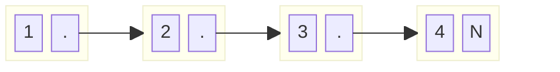
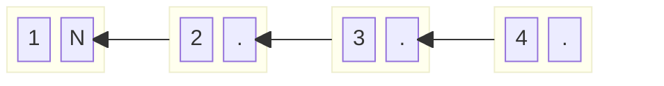
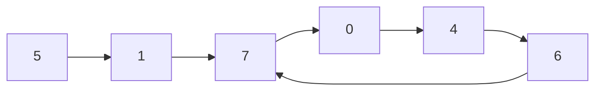
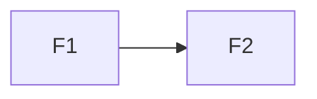
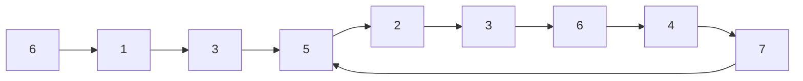
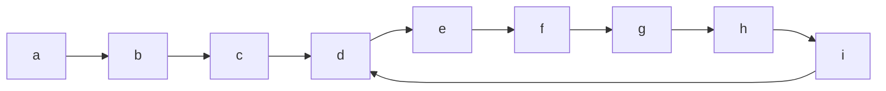
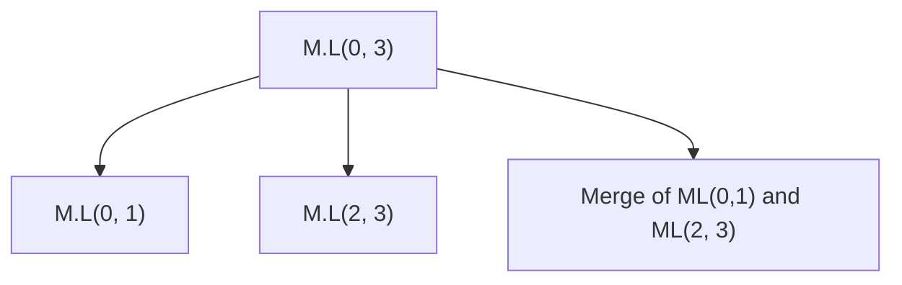
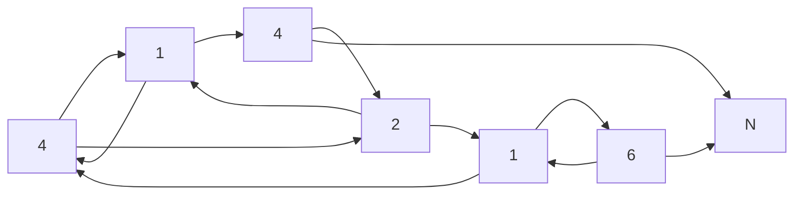
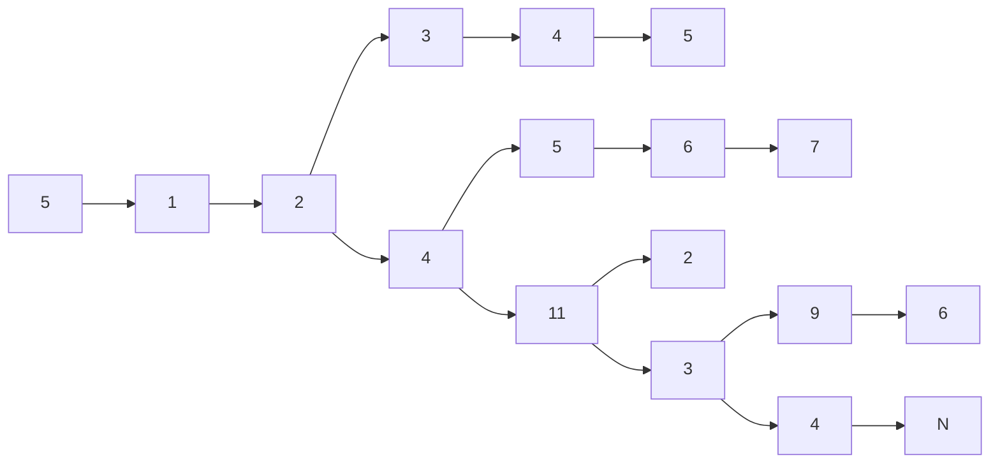

Arrays are fixed in size , while linked list, there is no fixed size, the memory is dynamic in nature.

**Analogies**

1. Buses are static
2. Trains are dynamic , you can just add another compartment.

Memory allocation in arrays is contiguos, in case of linked list , there is no need of contiguos
memory allocation.


```python
class Node:
    def __init__(self, data):
        self.data = data
        self.next = None


```

Inserting data in linked list

```python

head = None
tail = None

n = 10 # for example 10 element linked list

while n:
    tmp = Node(n)
    if not head:
        head = tmp
        tail = tmp
    else:
        tail.next = tmp
        tail = tail.next

    n-=1
```

Traversing the linked list

```python
tmp = head
while tmp:
    print(tmp.data)
    tmp = tmp.next
```

**Basic Operations**

`Search a node containing data = k`

```python
def searchLinkedList(head:Node, k:int):
    temp = head
    while temp:
        if temp.data = k:
            return True
        temp = temp.next
    return False
```

If the nodes are sorted , can we do this in logn time ?

This can be done using arrays since you get random access in the middle element , but you cannot get that in linked list

`Insert in a linked list`

If you want to insert a node at kth position , you have to reach at k-1 position , that means you have to do k-2 hops

```python

def insert(head:Node, pos:int, data:int):
    if pos == 1:
        nd = Node(data)
        nd.next = head
        head = nd
    else:
        curr = head
        i = 0
        while i<pos-2:
            curr = curr.next
            i+=1
        temp = curr.next
        nd = Node(data)
        curr.next = nd
        nd.next = temp
```

`Delete the node at the desired position`

```python
def delete(head:Node, pos:int):
    if pos == 1:
        temp = head
        head = head.next
        delete(temp)
    else:
        curr = head
        i = 0
        while i <pos-2:
            curr = curr.next
            i+=1
        temp = curr
        curr = curr.next
        delete(temp)
```

Given a linked list , Find the value of the middle node

Middle node is N/2 hops away from the initial node

If N is even just return the N/2 + 1 node

There are two friends who are standing between one end of two walls

How to find the middle point, make one guy to travel 2 times as the 1st friend

By the time 1st friend reaches the other end, the 2nd friend will be at middle point between two walls

```python

def findMiddle(head:Node):
    slowptr = head
    fastptr = head
    while fastptr and fastptr.next:
        slowptr = slowptr.next
        fastptr = fastptr.next.next
    return slowptr.data
```

Given a linked list, delete the $n^{th}$ node from the end

eg : 1 --> 5 --> 2 --> 4 --> 7 --> 16

n = 3 , out : 1 --> 5 --> 2 --> 7 --> 16

Intialise two pointers p1 and p2 , p1 to be head and p2 to n units away from p1

Now when move by one node on each pointer, by the time p2 reaches end , p1 is at a node
which is previous to the node to be deleted

```python

def delete_nth_node(head:Node, n:int):
    p1 = head
    p2 = head
    while n>0:
        p2 = p2.next
        n-=1
    if not p2:
        tmp = head.next
        del head
        return tmp
    while p2.next:
        p1 = p1.next
        p2 = p2.next
    temp = p1.next
    p1.next = p1.next.next
    del temp
    return head
```

Reverse a linked list

1. Traverse the linked list and push the elements to stack
2. Traverse again pop from the stack and update the linked list

How do we do that without tampering the data ?

Just change the links





In order to do that , you have to maintain both curr and prev pointers

N <- 1 <- 2 <- 3.........4 -> 5 -> 6
....................prev............curr......

N <- 1 <- 2 <- 3 <- 4........5 -> 6

.............................prev........curr.....

```python
def reverse(head:Node):
    curr = head
    prev = None
    temp = None

    while curr:
        temp = curr.next
        curr.next = prev
        prev = curr
        curr = temp
    return prev
    # prev would be pointing to the last element ,
    #at the time when curr will be pointing to null. so this will be our head
```

Reverse the linked list in a recursive manner

1. delink the head from remainder
2. newHead = make recursive call on remainder
3. link back

```python

def reverse_recurse(head:Node):
    if not head and not head.next:
        return head

    tmp = head.next
    head.next = None
    newhead = reverse_recurse(tmp)
    tmp.next = head
    return newhead
```

Given a linked list , every node contains a value belongs [0...9], check if its a palindrome

Input : 1->0->3->0->1
output : true

Take a stack , do a pass through the linked list and push elements to the stack
do a second traversal and compare top of the stack elements with linked list starting from head

`Another idea`

make the second half of the linked list reverse and compare first half with second half

how to achieve that ?

```python
def getMid(head:Node):
    slowptr = head
    fastptr = head
    while fastptr and fastptr.next:
        slowptr = slowptr.next
        fastptr = fastptr.next.next
    return slowptr

def isPalindrome(head:Node):
#find middle node
    mid = getMid(head)
    t  =  reverse(mid)
    h = head
    while t and h:
        if t.data != h.data:
            return False
    return True
```

Given a linked list and a integer k, k-reverse the linked list

what is k-reverse ?

e.g : 1->9->3->7->4->0

k = 2 , take chunks of 2 reverse those chunks and attach those chunks

9->1 7->3 0->4

9->1->7->3->0->4

In general take chunks of size k , reverse those chunks independently and attach those chunks

```python

def KReverse(head:Node, k:int):
    cnt = 0
    curr = head
    while curr and cnt<k:
        curr = curr.next
        cnt+=1
    if cnt<k:
        return head
    curr = head
    prev = None
    tmp = None
    cnt = 0
    while curr and cnt<k:
        tmp = curr.next
        curr.next = prev
        prev = curr
        curr = tmp
        cnt+=1

    head.next = KReverse(curr, k)
    return prev

```

**Cycle Detection**

Given a linked list , check if it contains a cycle



Store the addresses in map , when there is a repetition you find that address in the map

```python

def isCyclic(head:Node):
    mp = {}
    curr = head
    while curr:
        if mp.get(curr): return True
        mp[curr] = True
        curr = curr.next
    return False
```

There is a flat running track , there are two friends `F1` and `F2`



Speeds

F1 : 10 Km/hr
F2 : 15 Km/hr

they will not meet , since F2 moves faster and faster.

But what if its a circular track

What are we talking about here , we are talking about a linked list and a linked list with a cycle

If the initial distance between the two friends is perfectly divisible relative speed then they will surely meet

so if we set the relative speed to 1 , then it will be perfectly divisible and make sure the algorithm terminates.

$D \% (F2-F1) = 0$

```python

def isCyclic(head:Node):
    slow = head
    fast = head
    while fast and fast.next:
        slow = slow.next
        fast = fast.next.next
        if slow == fast:
            return True
    return False
```

**Cycle Detection II**

Given a linked list, find the frist node of the loop, return null if no loop



Hashing based approach works here as well and the first node to be found is the first node to be repeated

How to do with two pointers approach ?

```python

def isCyclic(head:Node):
    slow, fast = head, head
    hascycle:bool = False
    while fast and fast.next:
        slow = slow.next
        fast = fast.next.next
        if slow == fast:
            hascycle = True
            break
    if not hascycle:
        return None
    p = head
    while 1:
        tmp = slow
        while tmp ! = p:
            tmp = tmp.next
            if tmp == slow:break
        if tmp == slow:
            return tmp
        p = p.next

```

**Cycle Detection III**

How to do the earlier problem above in O(N) time

Both slow and fast pointers started at t = 0

dist_f = dist_s \* 2

$l_1 + (m*l_2) + d = 2*(l1+ (n*l2) + d)$
=> $l_1 + d = (m-2n)l_2$



Lets assume the distance from a to e :`l1`

by the time the slow pointer reaches point `d` , the fast pointer is at `g`

the distance fast pointer traveled = 2l1

distance from d to g : l1

lets assume now the distance between g to d : `d`

so total loop length = l1+d, which implies the distance between slow pointer and fast pointer

is distance : `d`

Since fast pointer is trying to come closer to slow pointer by 2 times and slow pointer is moving away from fast pointer by 1 time

So effective closeness happening in 1 step is 1 , so they have to travel `d` steps to be at the same point

Now slow pointer and fast pointer meet `g` , which implies out of the total loop length of `l1+d` , the slow pointer travelled `d` distance, if it just travels `l1` distance , it will reach the first node which is again `l1` distance from head

```python

# Once they meet at the meeting point
p = head
while p! = slow:
    p = p.next
    slow = slow.next
return p
```

**Merge two sorted linked lists**

M1: 1->2->7->8->9
M2: 3->4->19

O/P : 1->2->3->4->7->8->9->19

```python
def Merge(h1:Node, h2:Node):
    if not h1: return h2
    if not h2: return h1
    head, tail = None, None
    p1 = h1
    p2 = h2
    if h1.data <= h2.data:
        head, tail = h1, h1
        p1 = p1.next
    else:
        head, tail = h2, h2
        p2 = p2.next

    while p1 and p2:
        if p1.data <= p2.data:
            tail.next = p1
            p1 = p1.next
        else:
            tail.next = p2
            p2 = p2.next

        tail = tail.next

```

How can we do the above iterative approach into a recursive approach ?

1. Delink
2. Recursive call
3. Link

```python
def MergeRecursive(h1:Node, h2:Node):
    # termination condition
    if not h1 : return h2
    if not h2 : return h1
    # link
    head = None
    temp = None
    if h1.data<=h2.data:
        head = h1
        temp = head.next
        head.next = None
        head.next = MergeRecursive(temp, h2)
    else:
        head = h2
        temp = head.next
        head.next = None
        head.next = MergeRecursive(h1, temp)

    return head
```

**Merge `K` Sorted Linked Lists**

Input : List of head pointers of each linked list
Output : Single head pointer

Merge first two lists , and whatever the result of that , merge with third list and so on

```python
def MergeLists(listHeads:List):
    if not listHeads: return None
    ans = listHeads[0]
    for i in range(1, len(listHeads)):
        ans = MergeRecursive(ans, listHeads[i])
    return ans
```

Assuming N elements in each linked list

Time complexity : $O(N*k^2)$



```python

def MergeK(listHeads:List, i, j):
    if i == j: return listHeads[i]
    m = (i+j)/2
    h1 = MergeK(listHeads, i, m)
    h2 = MergeK(listHeads, m+1, j)
    return MergeRecursive(h1, h2)


def MergeLists(listHeads:List):
    if not len(listHeads) : return None
    MergeK(listHeads, 0 , len(listHeads)-1)

```

**Clone a List - 1**

Given a linked list and special kind of Nodes

```python
class Node:
    def __init__(self, data):
        self.data = data
        self.next = None
        self.random = None
```

Clone/Deep-copy this linked list



```python

def cloneLinkedList(head:Node):
    nodemap = {}
    cloneHead = None
    prev = None
    tmp = None
    curr = head
    while curr:
        tmp = Node(curr.data)
        nodemap[curr] = tmp

        if not prev:
            cloneHead = tmp
            prev = tmp
        else:
            prev.next = tmp
            prev = tmp

        curr = curr.next

    # Now random nodes
    curr1 = head
    curr2 = cloneHead

    while curr2:
        if curr1.random:
            curr2.random = nodemap[curr1.random]
        else:
            curr2.random = None

        curr1 = curr1.next
        curr2 = curr2.next

    return cloneHead
```

How to solve this without extra space ?

1. Attach the nodes of your cloned linked list in between the original linked list
2. curr.next.random = curr.random.next
3. delink the nodes present in between

```python

def func(head:Node):
    cloneHead = None
    tmp = None
    curr = head
    while curr:
        tmp = Node(curr.data)
        if curr == head:
            cloneHead = tmp
        t = curr.next
        curr.next = tmp
        temp.next = t
        curr = t

    # assign random nodes now
    curr = head
    while curr:
        if curr.random:
            curr.next.random = curr.random.next
        cur = curr.next.next

    # Now delink the original nodes

    curr = cloneHead
    curr1 = head

    while curr and curr.next:
        t = curr.next
        curr.next = curr.next.next
        curr = curr.next
        curr1.next = t
        curr1 = curr1.next
    if curr1
        curr1.next = None

    return cloneHead

```

Given a linked list flatten linked list

```python

class Node:
    def __init__(self, data):
        self.data = data
        self.next = None
        self.down = None # points to a list of another head of a linked list

```



Do nothing if any node doesnt have down pointer

Whenever a Node has down pointer , point that node to the tail.

**Doubly Linked List**

```python
class DoubleNode:
    def __init__(self, data):
        self.data = data
        self.next = None
        self.prev = None

# insert a node
temp = curr.next
new_node = DoubleNode(10)
curr.next = new_node
temp.prev = new_node
new_node.prev = curr
new_node.next = temp


# delete a node
n = curr.next
curr.next = curr.next.next
tmp = curr.next
tmp.prev = tmp.prev.prev
del n
```

**LRU - 1**

`Caching`

Suppose you go to facebook.com and request , the application server run some queries on database and the database returns data to the application server and that returns the html response to the browser of the user.

Now imagine you refreshing this page again and again , the user might load the application server , so in order to ease this load we apply something called caching

Use application server cache to just send the same response if the request is same

How to refresh cache , or move out the items from the cache ,
cache eviction strategy : `LRU cache : Least recently used strategy`, depends on how recent your data is.

Design an LRU cache that contains <key, value> both int.

1. put
2. get if not present return -1
3. max capacity will be defined

Use a combination of hashmap and linked list

hashmaps key should be memory int and value should be memory location

Data Structure Approach

1. Doubly linked list key, value , next ,prev
2. Hashmap key, node address

```python
def get(k):
    if not in map:
        return -1:
    else:
        #get node from map
        #ans = node.data
        #move this node to tail
        #return ans

def put(k, v):
    if k in map:
        #move node to tail with updated value
        return
    else:
        #if curr_size < max_size:
            #add new node to tail
            #make corresponding entry in the map
        #else:
            # delete head node
            # delte from map
            # add new node to tail
            # make corresponding entry in the map

# Write helper functions and keep your code modular
# moveToTail
# addToTail
# deleteHead
```

Implementation of LRU

```python
class Node:
    def __init__(self,key:int, value:int):
        self.key = key
        self.value = value
        self.prev = None
        self.next = None

class lruCache(capacity:int):
    def __init__(self, maxSize:int):
        self.maxSize = maxSize
        self.head:Node = None
        self.tail:Node = None
        self.keyToAddress:dict = {}
        self.currSize = 0

    def addToTail(self, key:int, value:int):
        node = Node(key, value)
        if self.tail:
            self.tail.next = node
            node.prev = self.tail
            self.tail = node
        else:
            self.head = node
            self.tail = node

        self.currSize+=1
        return node

    def moveToTail(self, node:Node, value:int):
        node.value = value
        if node == self.tail:
            return
        if node == head:
            self.head = self.head.next
            self.head.prev = None
        else:
            node.prev.next = node.next
            node.next.prev = node.prev

        node.prev = self.tail
        node.next = None
        self.tail.next = node
        self.tail = node

    def deleteAtHead(self):
        tmp = self.head
        self.head = self.head.next
        if self.head:
            self.head.prev = None
        else:
            self.tail = self.head
        del tmp
        self.currSize-=1


    def get(key:int):
        ans = None
        if not self.keyToAddress.get(key):
            ans = -1
        else:
            node = self.keyToAddress.get(key)
            ans = node.value
            self.moveToTail(node, node.value)
        return ans

    def put(key:int, value:int):
        if self.keyToAddress.get(key):
            self.moveToTail(keyToAddress[key], value)
            return
        if self.currSize < self.maxSize:
            self.keyToAddress[key] = self.addToTail(key, value)
        else:
            del keyToAddress[self.head.key]
            self.deleteAtHead()
            self.keyToAddress[key] = self.addToTail(key, value)

```
