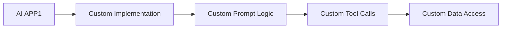
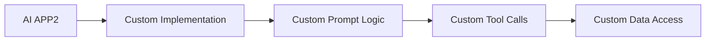
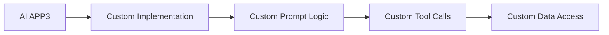
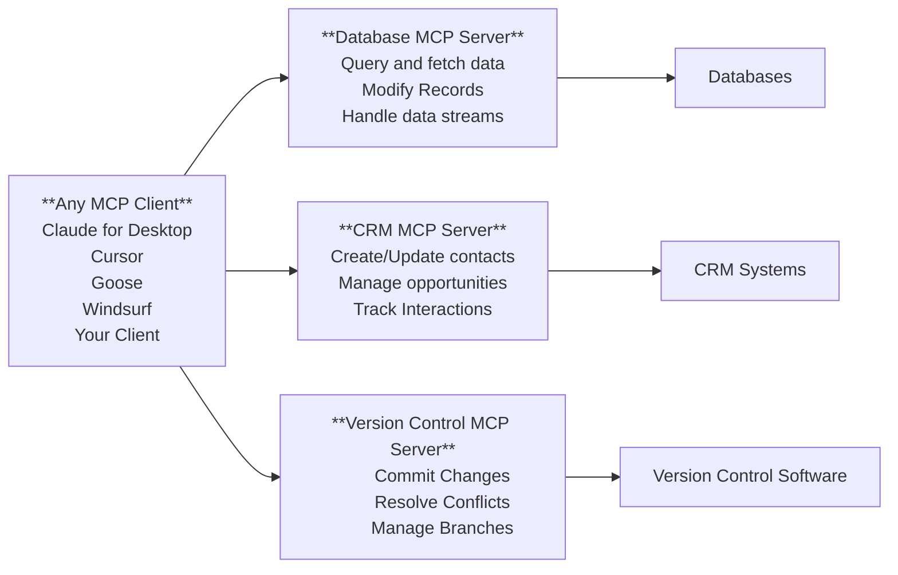
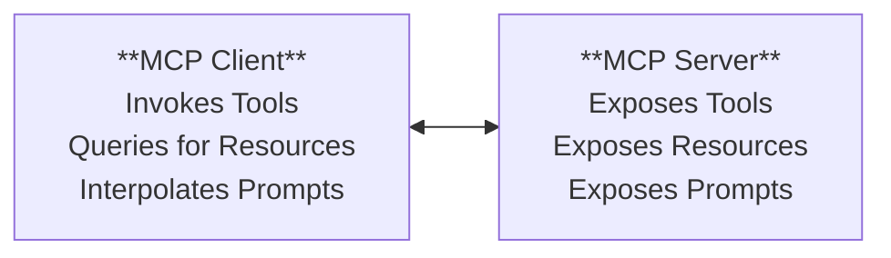
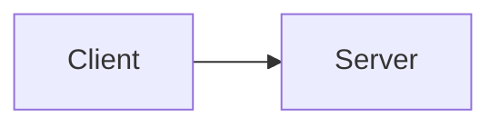
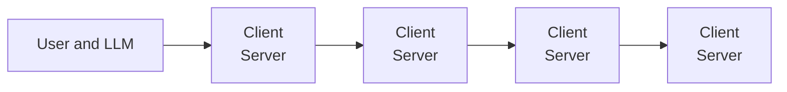
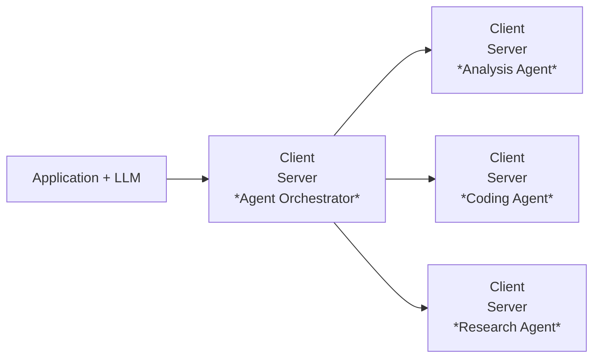

MCP is an open protocol that enables seamless integration between AI apps and agents and your tools and data sources

**API's**

Standardized how web applications interact with the backend

- servers
- databases
- services

**LSP**

Standardized how IDE's interact with language-specific tools

- Code navigation
- Code analysis
- Code Intelligence

**MCP**

Standardizes how AI applications interact with external systems

- Prompts
- Tools
- Resources

Without MCP : Fragmented AI Development

With the MCP Server

With MCP Standardized AI Development

1. For AI application developers : Connect your app to any MCP Server with 0 additional work
2. For Tool or API Developerfs : Build an MCP server once, see adoption everywhere
3. For end users : More powerful and context-rich AI applications
4. For enterprises : Clear seperation of concerns between AI product teams

MCP growing fast

1. ai applications , from ides to agents
2. server builders 1000+ and counting
3. enterprises for internal and external access
4. open source contributions

**MCP Deep Dive**

**Tools** : Model-Controlled , Functions invoked by model

1. Retrieve/Search
2. Send a message
3. Update DB records

**Resources** : Application Controlled, Data exposed to the application

1. Files
2. Database Records
3. API Responses

**Prompts**: User-controlled , Pre-defined templates for AI interactions

1. Document Q & A
2. Transcript Summary
3. Output as json

MCP will be the foundational protocal for agents

https://www.anthropic.com/engineering/building-effective-agents

**Building effective agents with mcp**

`Sampling` : Allows a server to request completions from a client , giving the user application full control over security, privacy and cost

Sampling parameters

1. Model preferences and hints
2. system prompt
3. Temperature and Max Tokens

Client and server is a logical seperation but not a physical one

**Composability**

An MCP client can be a server and vice-versa

**Sampling + Composability**

Chain agents together while making sure that client application controls inference

Whats next for MCP ?

1. MCP Inspector
2. Protocol supports oAuth 2.0 support

**An official MCP Registry API**

A unified, hosted metadata service which enables

1. Discovery
2. Centralization
3. Verification
