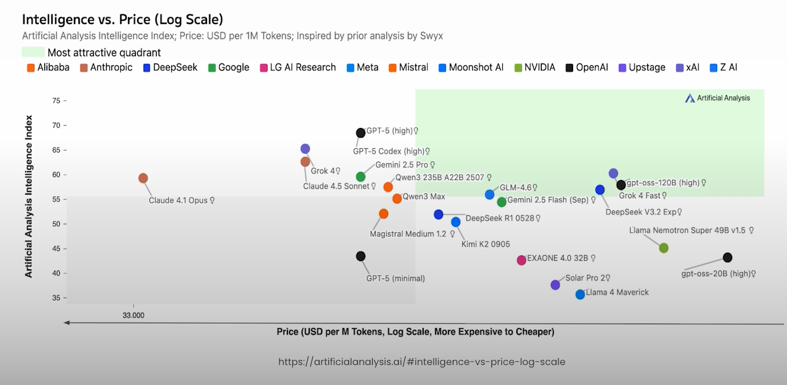
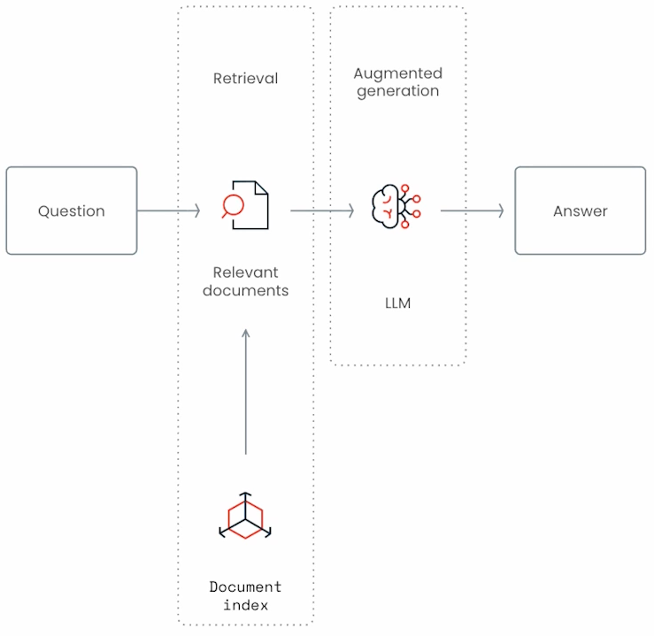
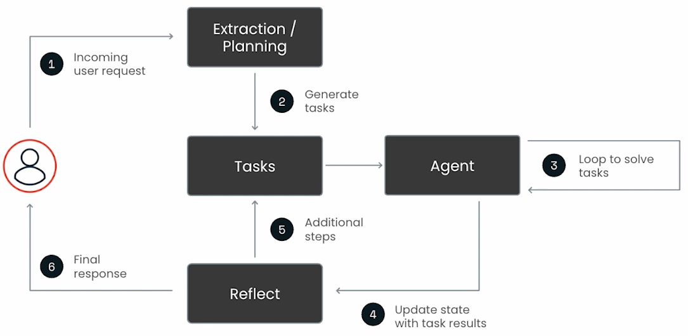
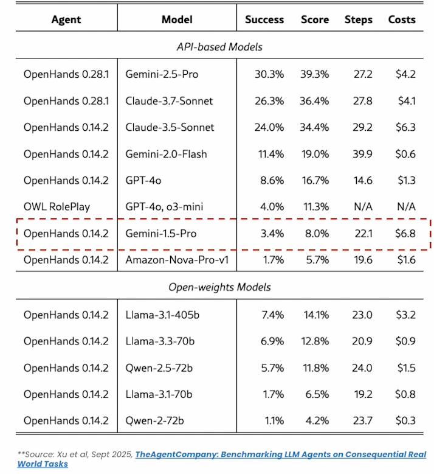
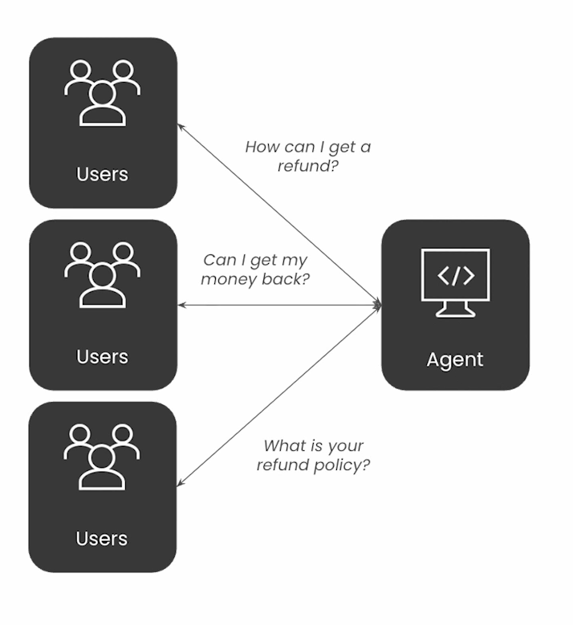
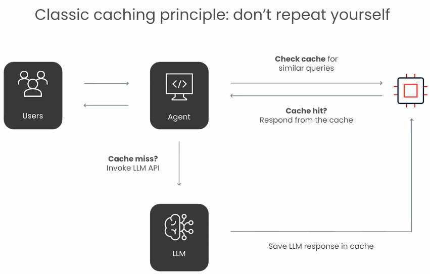
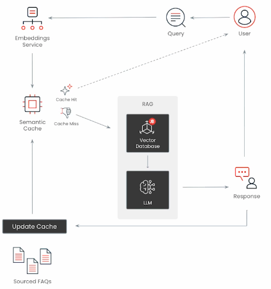
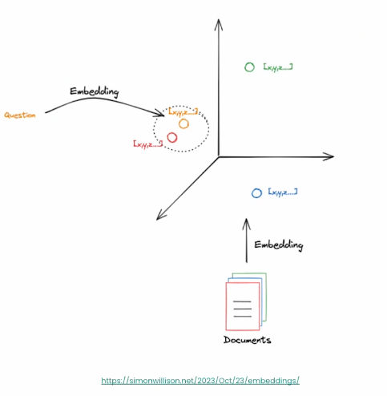
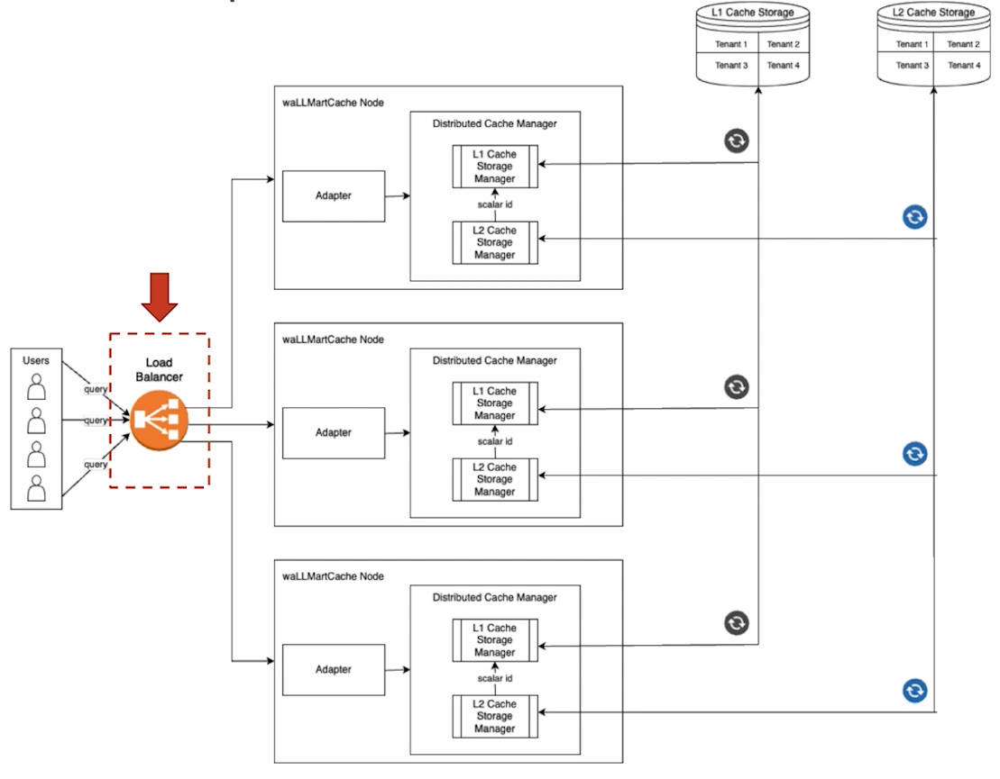
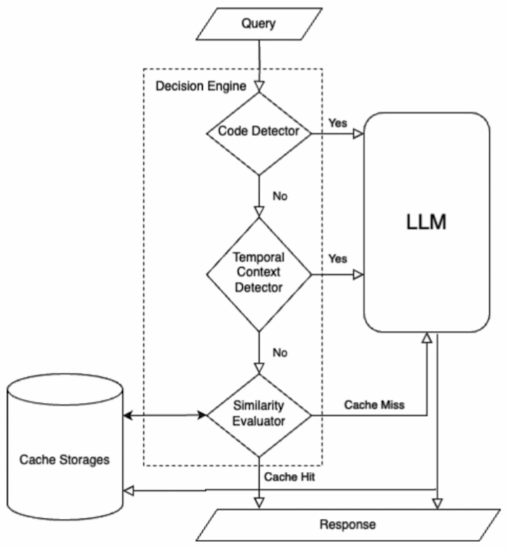

LLM Inference is the new bottleneck

#### RAG : Grounding LLMs with your own data

Retrieval Augmented Generation (RAG)

Ground an LLMs response with relevant and factual data provided in
context window

- **Reduce hallucinations** by inserting relevant info into the llm context
- **Stay fresh** by providing access to upt to date data at runtime that the LLM has never seen before

#### Agents are token hungry

- Agents by nature extract, plan , act , reflect and iterate
- Agents use many llm calls
  - consume more tokens
  - add additional latency
  - prompts grow in length over time

Scaling agents can be expensive , According to a real world benchmark, the avg cost of a complex agent workflow can reach upto 6.8$

#### Accelerating customer support : a common agentic use case

Customer support agents accelerate mean time to resolution (MTTR) of open customer inquiries.

- Slow agents negatively impact end customer UX
- Customer support agents generate piles of FAQs
- Redundant agentic RAG operations drive up infrastructure costs $$$

#### Classic caching principle : don't repeat yourself

#### Naive (exact-match) caching fails for natural language

1. I want my money back
2. How do I get refund ?
3. What is your refund policy ?

Traditional Caching

- Exact match on string data
- Perfect Precision
- Poor recall and low cache hit rates
- Cache Miss

#### Semantic Caching , but with new trade-offs

- Semantic search over vectorized texxt with optional reranking
- Higher recall and cache hit rates
- Higher risk of false positives
- Cache hit

#### How Semantic caching works from scratch

1. Embed user query -> convert user text into a vector
2. Compare similarity -> nearest-neighbor search vs existing cache entries
3. Classify -> compare nearest neighbor vector distance against cache distance threshold.
   - Cache hit? -> return stored answer instantly
   - cache miss? -> call RAG system, get new answer, respond and write back into cache.
4. RAG process
5. Respond
6. Update Cache

#### Vector search is the backbone

- Vectors are lists of numbers [-0.917, 0.370, 0.221, -0.478]
- Vectors represent data and encode meaning and semantics
- Example applications : Content Discovery, search , recommendations , anomaly detection.

#### Semantic caching in production introduces new challenges

- **Cache Effectiveness**
  - Accuracy : Are we serving the correct results from the cache
  - Performance : Are we hitting the cache often enough / Can we server the cache at scale without impacting round trip latency?

- **Updatability**
  - Can we refresh, invalidate or warm the semantic cache as data evolves over time ?

- **Observability**
  - Can we observer and measure cache hit-rate , latency , cost savings and cache quality?

#### Measuring cache effectiveness

- **Cache Hit Rate (CHR)**
  - Frequency of cache hits at a given threshold
  - Influences efficiency and potential cost savings

- **Precision**
  - Quality of hits (how many hits are correct)
  - Ensures reliability of cached results

- **Recall**
  - Coverage(how many possible correct results are captured)
  - Ensures important queries arent missed.

- **F1 Score**
  - Balance between Precision and Recall
  - Provides a single measure of overall cache effectiveness

#### Improving semantic cache accuracy and performance

- **Distance Threshold Tuning**
  - Adjust semantic decision boundary to balance recall/precision and reduce false positives
- **Cross Encoder Reranker**
  - Re-rank retrieved results with a higher fidelity model for improved relevance
- **LLM Reranker/Validator**
  - Use an LLM to validate or refine semantic search outputs

- **Efficiency and Resource Use**
  - Fuzzy Matching - Handle exact matches and typos before invoking cache embeddings , saving compute

- **Context and Filters**
  - **Temporal Context Detection**
    - Identify time-sensitive queries to avoid stale or irrelevant cache hits.
  - **Code Detection**
    - Filter out domain specific content (e.g code) that should bypass semantic caching.

#### Real World Example @ Walmart

Walmart released a paper describing their attempt at building a production-ready semantic caching system called `wallMartCache`

Distributed cache (Redis) + Decision Engine + FAQs pre-loaded yielded the highest overall accuracy at ~89.6%

- Distributed caching service with **load balancing** across multiple nodes.
- **Dual-tiered** cache storage
  - L1 -> Vector Database (retrieval)
  - L2 -> In-Memory Cache (lookup)
- **Multi-tenancy**

#### Decision Engine by Walmart

To improve cache precision beyond semantic search.

- Code Detection
- Temporal Context Detection
- Semantic Search

