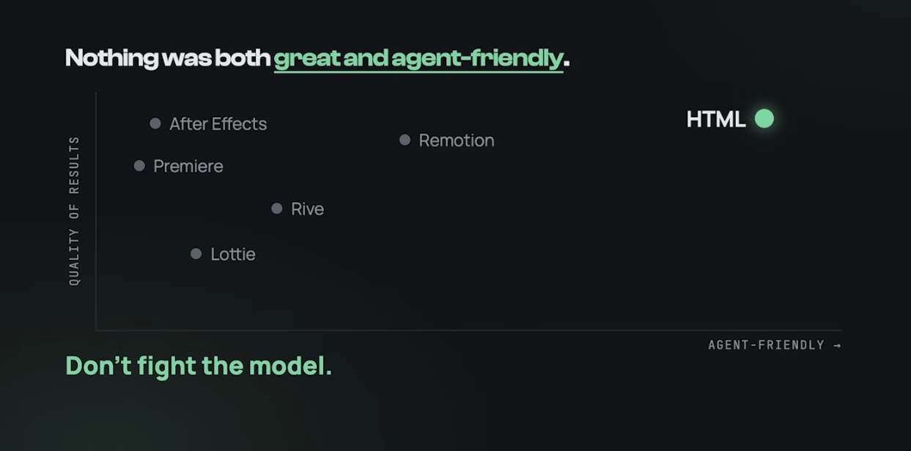

HTML, CSS and Javascript are the native language of LLMs.

Most of training data consists all of these. Why not make LLMs take their native language
and generate videos as well.

1. We let a small model design it, The simplest thing won, using Gemini 3 Flash

2. HeyGen HyperFrames that turns your agents HTML into video

3. Browsers are async on purpose. So "the same pixels everytime" fights everything

4. A video is just frames, we freeze the clock and seek frame by frame

5. Anything you can render in a browser can be in your video.

6. The skills dont teach the framework. They teach the taste.

7. Great videos --> motion , pacing , craft --> evals + agents refine them

8. One prompt for casuals , full control for power users

9. It works with any coding agent like claude code , codex and cursor

10. Models still arent good at creative work, evals a code to video benchmark
