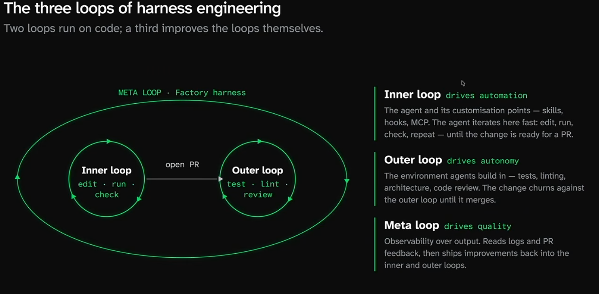

#### Software Factories

- A software factory is an agentic system where the final product is built entirely by agents
- Humans only shape the work and improve automation, autonomy, and quality.

Key Metrics

- Automation : How much human correction do agents need ?
- Autonomy : How much oversight do agents need ?
- Quality : How good is the end product delivered to users ?

The payoff is more than raw speed

- Higher velocity : Ship features faster, around the clock
- Higher quality : Factories give more visibility into quality and the capacity to act on it.
- Broader exploration : Everyone can contribute ideas; every idea can be tried
- More fun : Focus shifts to shaping ideas , defining quality and architecting the system

#### Harness engineering

- The direct creation , monitoring , and improvement of a project's loops
- Stop hand-building features and start building the machine that builds them.

Why hareness engineering is hard ?

1. Knowledge gaps : A new discipline with rapidly evolving best practice.
2. Unplanned work : Hard to anticipate agents fail -- or how long fixing them takes.
3. Competes with shipping : Foundational agent improvements don't directly touch customers, and can take time to pay off.
4. Poor legibility : The signal you need is locked in local sessions and people's heads -- sometimes captured nowhere at all.

#### Components of the agentic stack

- Layer 01 : Control Plane (where work is shaped and reviewed) : Issue tracker, PR review, Skills/ plugin registry
- Layer 02 : Agent IT (Context and Connectivity) : Company brain , Internal services , production logs and traces , execution environments
- Layer 03 : Improvement loops (How the stack gets better) : Repo maintenance, development playbooks, task automation , output quality optimization

#### The new factory SDLC , with Tessl

Reach the cutting edge reliably and sustainbly

- Batteries included : A harness engineering agent thats alwaysup to date with latest best practices
- Modular and open : Factory building blocks on open standards -- artifacts that you control
- Automated improvements : Background optimization discovered from your own tickets and feedback
- Incremental adoption : Built to slot into your stack one piece at a time

