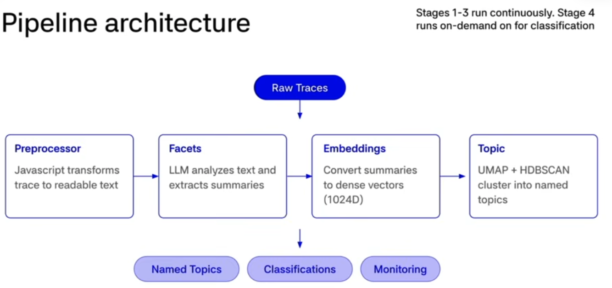

Braintrust is the AI Observability and eval platform.

The three types of Scorers

1. Code-Based : string matching , format validation , length constraints , json schema
2. LLM Judge : Tone , moderation , brand alignment, agent routing, helpfulness, factuality, relevancy, tool accuracy
3. LLM Judge aligned with Human Review : Fuzzy quality assessments for the the most important subject criteria, Human review provides ground trught , LLM judge learns from annotations over time

- code-based : Did the agent use the correct syntax ?
- LLM Judge : Did the agent make the appropriate routing decision ?
- LLM Judge + Human : Does the LLM judge have all the context it needs to grade effectively ?

#### LLM Judge Best Practices

- Enable chain of thought reasoning
- Use binary scoring , be harsh
- Use different model for scoring than for generation
- Include explicit examples (few-shot) in prompts
- Use Loop to help iterate, improve and align

| Feature         | Offline Scoring                          | Online Scoring                          |
| :-------------- | :--------------------------------------- | :-------------------------------------- |
| **Purpose**     | Development, testing, and baselining     | Production monitoring and observability |
| **Timing**      | Prior to deployment (CI/CD)              | Real-time as logs arrive                |
| **Goal**        | Validate improvements/detect regressions | Identify unknown failure modes          |
| **Environment** | Controlled, static datasets              | Live traffic/production traces          |
| **Cost/Scale**  | Limited to test set size                 | Depends on sampling rates               |

AI product has papercuts you cant see

- Silent failures : Issues arent caught neatly by factuality , moderation or other common evaluations
- Evals arent perfect : To hillclimb with your scores just like your agents , you need to know how things go wrong
- Edge cases : Users are unpredictable . Someone uses your ecommerce chatbot to slove programming problems. Is it a new use case or something to prevent ?
- Cold starts : Your agent is already in prod. Writing your first evals can be hard.

What are Topics ?

1. AI powered clusterings : Automatically groups thousands of traces into meaningful categories
2. Built-in and custom facets : Instantly categorize by user intent, issues, or sentiment. Define your own dimensions with custom prompts
3. Custom preprocessors : Handle non-LLM content like tool calls and structured outputs using Typescript or Python
4. Visual outputs : Bar charts , 2D scatter plots, and heirarchical sub-clusters to visualize your data distributions

Why use Topics ?

- Blind-spot detection : Suface unknown user requests and failure modes
- Product roadmap and investment signals : Inform what to build and where to spend engineering time
- Targeted evaluations datasets : Filter classified logs to build datasets for focused evals

**The Problem** : As AI applications scale to thousands of traces , manual review becomes impossible. Teams lose sight of "unknown unknowns" patterns driving errors that are invisible in raw logs.

**The Solution** : Topics Proactively finds things worth looking at. It converts production behavior into reproducible examples that any actor , human or agent can use to improve the system.
